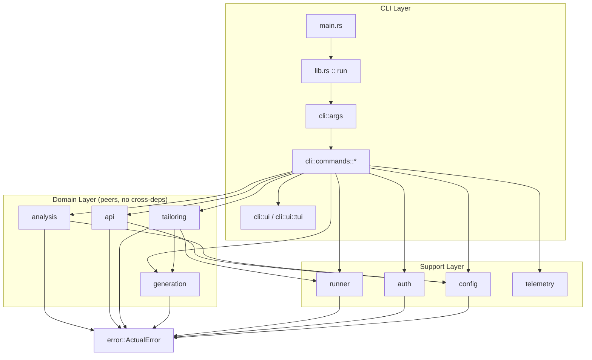
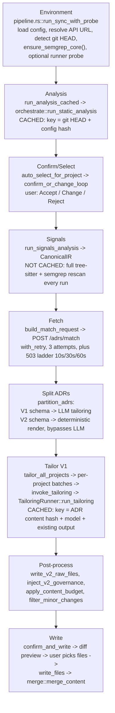

# actual-cli: Architecture Reference

Reference doc for working in this codebase. Jump to a section via the headers
below. For what the tool does and how to install/use it, see
[README.md](README.md) and [docs/GETTING_STARTED.md](docs/GETTING_STARTED.md).

## Contents

1. [Quick Reference](#1-quick-reference)
2. [Task Index](#2-task-index)
3. [Architecture Diagram](#3-architecture-diagram)
4. [Module Reference](#4-module-reference)
5. [Core Data Flow](#5-core-data-flow-actual-adr-bot)
6. [Core Data Structures](#6-core-data-structures)
7. [Extension Seams](#7-extension-seams)
8. [Conventions](#8-conventions)
9. [Known Pitfalls / Constraints](#9-known-pitfalls--constraints)
10. [Cross-References](#10-cross-references)

---

## 1. Quick Reference

```bash
cargo build                                    # target/debug/actual
cargo build --release                          # target/release/actual (LTO, stripped)
cargo fmt --check
cargo clippy -- -D warnings
cargo test --workspace --features integration
cargo llvm-cov --workspace --lcov --output-path lcov.info   # coverage; CI enforces 100% per file
```

- Entry chain: `src/main.rs` → `src/lib.rs::run` → matches `Command`
  (`src/cli/args.rs`) → one `exec()` per subcommand in `src/cli/commands/`.
- The whole `actual adr-bot` pipeline runs in one function:
  `run_sync_with_probe` in `src/cli/commands/sync/pipeline.rs`.
- Config/cache file: `~/.actualai/actual/config.yaml`. Override with
  `ACTUAL_CONFIG` (exact path) or `ACTUAL_CONFIG_DIR` (directory). Both must
  be absolute, no `..` (`src/config/paths.rs`).
- Workspace: root package (binary `actual`) + `crates/tui-test` (PTY-based TUI
  test harness, dev-only).

---

## 2. Task Index

| Task | Files |
|---|---|
| Add a manifest/dependency parser | `src/analysis/static_analyzer/manifests.rs` |
| Add a framework signature | `src/analysis/static_analyzer/registry.rs` |
| Add monorepo-detection support for a new tool | `src/analysis/static_analyzer/monorepo.rs` |
| Add a tree-sitter/semgrep detection rule | `src/analysis/detectors/{tree_sitter_queries,semgrep_rules}/`, embedded via `build.rs` |
| Add an AI backend/runner | Implement `TailoringRunner` (`src/runner/subprocess.rs`) in `src/runner/<name>.rs`; wire into `src/cli/commands/sync_wiring.rs` and `RunnerChoice` in `src/cli/args.rs` |
| Change the tailoring prompt or output schema | `src/runner/prompts.rs`, `src/runner/schemas.rs`; obfuscated strings in `build.rs` (keep `src/runner/obfuscation.rs` key in sync) |
| Change output merge/marking | `src/generation/markers.rs`, `src/generation/merge.rs` |
| Change the char/token budget | `src/generation/budget.rs` |
| Add/change a CLI flag or subcommand | `src/cli/args.rs`; dispatch in `src/lib.rs::run` |
| Change error types, exit codes, hints | `src/error.rs` |
| Change the Actual API request/response contract | `src/api/types.rs`, `src/api/client.rs` |
| Change retry/backoff | `src/api/retry.rs` (generic); `src/cli/commands/sync/pipeline.rs::fetch_with_503_backoff` (503 ladder) |
| Trace or modify the sync pipeline | `src/cli/commands/sync/pipeline.rs` |
| Change config shape/defaults | `src/config/types.rs` |
| Change `actual config set <dotpath> <value>` | `src/config/dotpath.rs` |
| Change platform login (OAuth/PKCE) | `src/auth/oauth.rs`, `src/auth/pkce.rs`, `src/auth/loopback.rs` |
| Add/modify a TUI screen | `src/cli/ui/tui/renderer.rs`, `src/cli/ui/tui/steps.rs` |
| Add unit tests | Co-locate `#[cfg(test)] mod tests`; see `src/testutil.rs` for the env-var-safe helper pattern |
| Add an integration test file | `tests/`, following `tests/common/mod.rs`. Also add the binary name to `.github/workflows/coverage.yml`'s `--test` list, or it won't count toward coverage |

---

## 3. Architecture Diagram

Static module structure. `error` is the shared leaf every module depends on.
For runtime sequence, see §5.



`analysis`, `api`, `generation`, `runner`, `config`, `auth` never depend on
`cli`. The CLI layer is the only thing that wires domain modules together. No
cycles.

---

## 4. Module Reference

| Module | Purpose | Key files | Key types |
|---|---|---|---|
| `analysis/` | Monorepo/language/manifest/framework detection, plus tree-sitter + semgrep signals compressed into an IR | `static_analyzer/{monorepo,languages,manifests,frameworks,registry}.rs`, `signals/{pipeline,ir,tree_sitter,semgrep,language_resolver}.rs`, `orchestrate.rs`, `cache.rs` | `RepoAnalysis`, `Project`, `Framework`, `ToolMatch`, `CanonicalIR` |
| `api/` | Actual API client, wire types, generic retry | `client.rs`, `types.rs`, `retry.rs` | `ActualApiClient`, `MatchRequest`/`MatchResponse`, `Adr` |
| `auth/` | Actual platform identity (OAuth + PKCE). Distinct from runner auth | `oauth.rs`, `pkce.rs`, `loopback.rs`, `store.rs` | `StoredCredentials` |
| `cli/` | Arg parsing (clap), command handlers, terminal + ratatui TUI | `args.rs`, `commands/*`, `ui/*` | `Cli`, `Command`, `SyncArgs`, `AdvisorArgs` |
| `config/` | YAML config load/save, dotpath get/set, rejection + sticky-scope memory | `paths.rs`, `types.rs`, `dotpath.rs`, `rejections.rs`, `sticky.rs` | `Config` |
| `generation/` | Managed-marker protocol, section merging, char budget, file writer | `markers.rs`, `merge.rs`, `budget.rs`, `writer.rs`, `format.rs` | `OutputFormat`, `WriteResult` |
| `runner/` | 5 AI backends behind one trait, plus auth/probe/binary discovery | `subprocess.rs`, `anthropic_api.rs`, `openai_api.rs`, `codex_cli.rs`, `cursor_cli.rs`, `probe.rs` | `TailoringRunner`, `InvocationOptions` |
| `tailoring/` | Batches ADRs, runs concurrent per-project tailoring, bundles repo context, validates LLM output | `concurrent.rs`, `invoke.rs`, `context_bundler.rs`, `batch.rs`, `filter.rs` | `TailoringOutput`, `FileOutput`, `TailoringEvent` |
| `telemetry/` | Anonymous fire-and-forget usage counters (feature-gated on `telemetry`) | `reporter.rs`, `metrics.rs`, `identity.rs` | `SyncMetrics` |

`crates/tui-test/` (workspace member, dev-only): PTY-based TUI test harness.
`session.rs` (`TuiSession`), `screen.rs`, `keys.rs`, `render/` (PNG capture for
visual diffing).

---

## 5. Core Data Flow: `actual adr-bot`



Notes:
- Two caches, two keys. Analysis invalidates on git HEAD or config change.
  Tailoring invalidates on ADR content, model, or existing-output change.
  `--force` bypasses both.
- Signals recompute every run. No signals cache.
- Only V1 ADRs reach the LLM. V2 ADRs render deterministically to
  `docs/adr/<slug>.md` and `.claude/rules/<slug>.md`, unmarked, no merge
  protocol.
- Managed markers are the non-destructive-write contract
  (`generation/markers.rs`). Content outside
  `<!-- managed:actual-start -->` / `<!-- managed:actual-end -->` is never
  touched. Inside the markers, `merge_content` does section-level merge keyed
  by `<!-- adr:<uuid> ... -->` boundaries: replace changed sections, add new
  ones, remove dropped ones, preserve order.

---

## 6. Core Data Structures

```rust
// src/analysis/types.rs
struct RepoAnalysis { is_monorepo: bool, workspace_type: Option<WorkspaceType>, projects: Vec<Project> }
struct Project {
    path: String, name: String,
    languages: Vec<LanguageStat>, frameworks: Vec<Framework>,
    package_manager: Option<String>, description: Option<String>,
    dep_count: usize, dev_dep_count: usize,
    selection: Option<ProjectSelection>,   // None until confirm/select step
}
```

```rust
// src/analysis/signals/mod.rs, ir.rs
struct ToolMatch { rule_id, facet_slot, leaf_id, value, confidence, spans, raw }  // universal signal record
struct CanonicalIR {
    ir_text: String,                                  // deterministic, line-based, hashed
    facets_by_leaf_id: HashMap<String, FacetData>,
    ir_hash: String, taxonomy_version: String,
    match_count: usize, leaf_count: usize,
}
```

```rust
// src/tailoring/types.rs - the LLM's JSON output contract
struct TailoringOutput { files: Vec<FileOutput>, skipped_adrs: Vec<SkippedAdr>, summary: TailoringSummary }
struct FileOutput { path: String, sections: Vec<AdrSection>, reasoning: String }
struct AdrSection { adr_id: String, content: String }
```

```rust
// src/api/types.rs
struct MatchRequest { projects: Vec<MatchProject>, options: Option<MatchOptions> }
struct Adr {
    id, title, context, policies, instructions, category, applies_to,
    matched_projects, schema_version, content_md, content_json, source,
}
// Adr::is_v2() -> bool: the V1/V2 split point used in the pipeline
```

---

## 7. Extension Seams

```rust
// src/runner/subprocess.rs - implement to add an AI backend
pub trait TailoringRunner: Send + Sync {
    fn run_tailoring(
        &self, prompt: &str, schema: &str,
        model_override: Option<&str>, max_budget_usd: Option<f64>,
    ) -> impl Future<Output = Result<TailoringOutput, ActualError>> + Send;

    fn set_event_tx(&self, _tx: UnboundedSender<String>) {}  // default no-op
}
```
Implementers: `CliClaudeRunner`, `AnthropicApiRunner`, `OpenAiApiRunner`,
`CodexCliRunner`, `CursorCliRunner`. The sync pipeline is generic over
`R: TailoringRunner`, so a new impl plugs in without touching pipeline logic.

```rust
// src/cli/ui/terminal.rs - real vs mock interactive I/O
pub trait TerminalIO: Send + Sync {
    fn read_line(&self, prompt: &str) -> Result<String, ActualError>;
    fn write_line(&self, text: &str);
    fn confirm(&self, prompt: &str) -> Result<bool, ActualError> { /* default via read_line */ }
}
```
`RealTerminal` (prod, blocks on stdin, excluded from coverage) vs
`MockTerminal` (`src/cli/ui/test_utils.rs`).

```rust
// src/cli/ui/tui/renderer.rs - real vs mock keyboard events
pub(crate) trait EventSource {
    fn next_key(&mut self) -> io::Result<crossterm::event::KeyEvent>;
}
```
`CrosstermEventSource` (prod) vs `MockEventSource` (tests).

One more seam, no trait: `sync_wiring::sync_run_inner(args, auth_fn)` takes an
injectable auth-check function. `sync_run` is the thin, untested prod shim
over it.

---

## 8. Conventions

- Errors: one `thiserror` enum, `ActualError` (`src/error.rs`). Add an
  `exit_code()` arm and, where a fix is known, a `hint()` arm:
  ```rust
  // exit_code()
  Self::ClaudeNotFound | Self::ClaudeNotAuthenticated | Self::NotLoggedIn
      | Self::NoRunnerAvailable { .. } | Self::ApiKeyMissing { .. } => 2,

  // hint()
  Self::ClaudeNotFound => Some(Cow::Borrowed("npm install -g @anthropic-ai/claude-code")),
  ```
- Tests co-locate: `#[cfg(test)] mod tests` in the same file. Integration
  tests (black-box, cross-command) go in `tests/`.
- Env-var tests must serialize: take `testutil::ENV_MUTEX` and use the RAII
  `EnvGuard` (`src/testutil.rs` for unit tests, `tests/common/mod.rs` for
  integration tests). Skipping this causes flaky parallel runs, not a compile
  error.
- Logging: `tracing`, not `println!`, except in command-handler user-facing
  output.
- Result types: `anyhow::Result` in binary-only paths, typed
  `Result<_, ActualError>` in library code.
- Coverage: CI enforces 100% per-file line coverage. New code needs tests for
  every branch, including error paths.

---

## 9. Known Pitfalls / Constraints

- `sync/pipeline.rs` is the largest file in the repo, effectively one function
  implementing all five phases plus its test module. Changes here are
  higher-risk and need proportionally more tests to satisfy the coverage gate.
- The coverage gate lists integration test binaries by name in
  `.github/workflows/coverage.yml`. A new file under `tests/` doesn't count
  toward coverage until added to that `--test` list. `tui_e2e` is deliberately
  excluded (hangs under coverage instrumentation).
- ADR `29aaf503` (`.claude/rules/`) requires a `benches/` directory that does
  not exist. Its own verify command (`test -d benches`) fails today. Don't
  treat that rule's accept criteria as ground truth without checking the repo.
- `tests/common/mod.rs` duplicates `src/testutil.rs` (both provide an
  `ENV_MUTEX`/`EnvGuard` pair independently) instead of sharing one
  implementation. Both exist; don't add a third.
- The `integration` Cargo feature gates exactly one test, which is also
  `#[ignore]`d. CI always passes `--features integration` by convention, but
  the flag itself does little.
- `src/telemetry/reporter.rs` hardcodes a `SERVICE_KEY` constant. This is a
  write-only, counter-increment-only token, documented as such in the module.
  Not a credential leak.
- `DEFAULT_API_URL` is defined twice, identically, in `src/api/client.rs` and
  `src/config/types.rs`. Update both if it changes.
- The config file doubles as the cache store. `cached_analysis` and
  `cached_tailoring` live inside `config.yaml`, and the config is re-saved
  mid-pipeline. `compute_config_hash` excludes both fields so caching doesn't
  self-invalidate.
- Prompts and the tailoring output JSON schema are XOR-obfuscated at build
  time (`build.rs` / `src/runner/obfuscation.rs`). Documented as anti-`strings`
  obfuscation only, not a security control: the key ships in the same binary
  as the data it encodes. Update both sides together when changing prompt
  text.
- Two auth surfaces, don't conflate: `runner::auth`/`runner::probe` checks
  whether the coding agent (Claude Code CLI etc.) is logged in. `auth::*`
  checks whether the user is logged into the Actual platform. `actual auth`
  uses the former; `actual login/logout/whoami/advisor` use the latter.

---

## 10. Cross-References

- [README.md](README.md): what the tool does, install, output formats
- [CONTRIBUTING.md](CONTRIBUTING.md): PR workflow, CI checks, coding standards
- [docs/GETTING_STARTED.md](docs/GETTING_STARTED.md): full flag/config/env reference
- [docs/adr/](docs/adr/): the ADRs governing this repo itself. This project
  dogfoods its own tool; `.claude/rules/`, `.cursor/rules/`, and the project's
  `CLAUDE.md`/`AGENTS.md` files are generated from these
- [WORKFLOW.md](WORKFLOW.md): Symphony/Linear agent-orchestrator config used
  for automated PR work on this repo
- [CHANGELOG.md](CHANGELOG.md): release history
