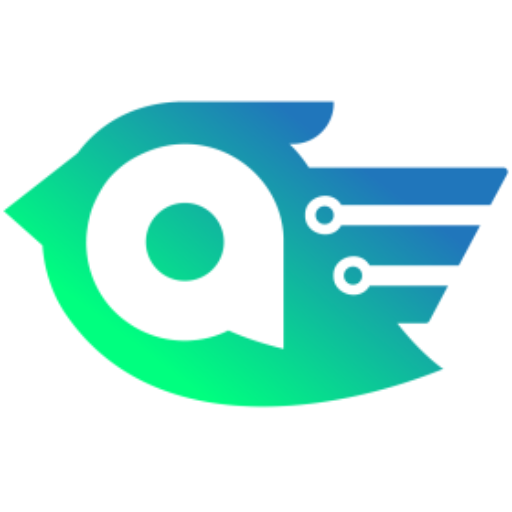

<h1 align="center">Actual.ai CLI</h1>

<p align="center">
  <a href="https://actual.ai/cli">
    
  </a>
</p>

<p align="center"><strong>Architecture questions, answered from your ADRs.</strong></p>

<p align="center">Use it through the <a href="https://github.com/actual-software/actual-skill">Actual.ai Skill</a>, which wraps the Actual.ai CLI for your coding agent.</p>

<p align="center">
  <a href="https://github.com/actual-software/actual-cli/actions/workflows/build-and-test.yml"></a>
  <a href="https://github.com/actual-software/actual-cli/blob/main/LICENSE"></a>
  <a href="https://github.com/actual-software/actual-cli/stargazers"></a>
  <a href="https://github.com/actual-software/actual-cli/issues"></a>
</p>

## Quickstart

### 1. Install Actual.ai Skill — Claude Code CLI

Start with the [Actual.ai Skill](https://github.com/actual-software/actual-skill). The skill wraps the Actual.ai CLI so your coding agent can use it, and installs the CLI for you on first run. Run each step as its own copy/paste.

Step 1 — add the actual-skill repo as a marketplace:

```
/plugin marketplace add actual-software/actual-skill
```

Step 2 — install the plugin:

```
/plugin install actual-cli@actual-cli-skills
```

Step 3 — reload plugins so Claude Code CLI loads the newly installed plugin:

```
/reload-plugins
```

### 2. Install Actual.ai CLI — npm / npx

The skill installs the CLI on its own, so you only need this step for scripts and CI or to run the CLI outside an agent.

Step 1 — install the CLI globally:

```
npm install -g @actualai/actual
```

Or skip the install and run any command with `npx @actualai/actual <command>`.

Step 2 — sign in with browser OAuth:

```
actual login
```

Step 3 — ask your first architecture question:

```
actual advisor "Should new services talk over gRPC or REST?"
```

<details>
<summary><strong>Install Actual.ai CLI — Homebrew</strong></summary>

```bash
brew install actual-software/actual/actual
```

</details>

<details>
<summary><strong>Install Actual.ai CLI — Manual download / Build from source</strong></summary>

Download the binary for your platform from the
[releases repository](https://github.com/actual-software/actual-releases/releases)
(binaries are published separately from source), then:

```bash
chmod +x ./actual
sudo mv ./actual /usr/local/bin/actual

# macOS only: remove quarantine before running
xattr -dr com.apple.quarantine /usr/local/bin/actual
```

To build from source you need a C compiler for the tree-sitter native dependencies:

```bash
# macOS: Xcode command-line tools (usually already installed)
xcode-select --install

# Debian/Ubuntu
sudo apt-get install build-essential

cargo install --git https://github.com/actual-software/actual-cli.git
```

</details>

## Use Actual.ai Skill + CLI

Once the [Actual.ai Skill](https://github.com/actual-software/actual-skill) is installed, ask your agent in plain language. The skill manages the CLI and picks the right command for each request. For example:

- "Set up Actual for this repository."
- "Preview the ADR guidance Actual would add here."
- "Ask the Actual advisor how we should handle database access in a new service."
- "Sign me in to Actual AI."
- "Diagnose why Actual is failing."

In Codex, you can also call the skill directly by starting the prompt with `$actual`.

<details>
<summary><strong>Use Actual.ai CLI directly — Terminal examples</strong></summary>

These are the commands the skill manages for you. To run them yourself, sign in and run them from inside any git repository. For example:

```bash
actual advisor "How should we handle database access in a new service?"
actual adr-bot --dry-run      # preview the ADR guidance Actual would write
actual adr-bot                # write it to CLAUDE.md
actual plan-check --plan-file plan.md
actual impl-check             # check your working tree against .actual/rules/
actual whoami                 # show the signed-in account and organization
```

</details>

## What are the Actual.ai Skill and CLI?

The Actual.ai CLI is the engine behind the [Actual.ai Skill](https://github.com/actual-software/actual-skill). Together they give your AI coding agents guardrails for AI-powered software development. The skill is how you and your agent use Actual: you ask in plain language, and the skill manages the CLI for you. The CLI connects your agent to the Advisor, which answers org-scoped architecture questions from your team's Architectural Decision Records (ADRs), and every answer cites the decisions it drew on.

## Why do I need the Actual.ai Skill and CLI?

Coding agents don't know the architecture decisions your team has already made, so they write code that ignores them. The skill gives your agent that context and checks its plans and changes against your rules, running the CLI underneath, so its code follows your architecture from the start. You don't have to remember a command to get there.

## Who are the Actual.ai Skill and CLI for?

AI-native software teams: developers who build with coding agents and want answers, plans, and code grounded in the architecture decisions their team has already made. Most teams install the skill and let it manage the CLI. Teams wiring Actual into scripts or CI can also call the CLI directly.

## Where do the Actual.ai Skill and CLI work?

The skill works inside the coding agent your team already uses: Claude Code, Codex, ChatGPT, Cursor, or OpenCode. The CLI it wraps writes context for Claude Code, Codex, and Cursor, and uses five runners: `claude-cli` (the default), `anthropic-api`, `openai-api`, `codex-cli`, and `cursor-cli`. Outside an agent, the CLI also runs on its own in your terminal and in CI.

| Platform | Architecture | Install method |
|----------|--------------|----------------|
| macOS | Apple Silicon (arm64) | Actual.ai Skill, Homebrew, npm, manual download |
| macOS | Intel (x64) | Actual.ai Skill, Homebrew, npm, manual download |
| Linux | x64 | Actual.ai Skill, npm, manual download |
| Linux | arm64 | Actual.ai Skill, npm, manual download |

Windows is not currently supported.

## When do the Actual.ai Skill and CLI run?

Whenever an architecture question comes up. The skill manages the CLI and decides when each command runs. Before your agent writes code, the skill asks the Advisor how your team builds things. When your agent's context needs refreshing, the skill runs `actual adr-bot`. In Claude Code, the skill also runs `actual plan-check` before implementation starts and `actual impl-check` at the end of every turn.

## How do the Actual.ai Skill and CLI work?

Each capability below is something you ask the skill for, and the skill wraps the matching CLI command. If you're scripting or running in CI, open the Direct CLI section under each one.

### Browser OAuth in seconds

Ask your agent to "sign me in to Actual AI." The skill runs `actual login`, which signs you in through your browser and stores your credentials locally.

<details>
<summary><strong>Direct CLI</strong></summary>

`actual whoami` shows the signed-in account, organization, and scopes, and `actual logout` signs you out. For CI and headless agents, see [Agent authentication](docs/AGENT_AUTH.md): `actual auth create-token` mints a scoped access token from an existing session, and `actual mint-token` signs one from a service-account key when there is no human to sign in.

</details>

### Org-scoped architecture answers

When your agent hits an architecture question, the skill asks the Advisor through `actual advisor`. The answer is grounded in your team's ADRs and cites its sources, so you can trace every recommendation back to a decision your team made. The question is scoped to the repository you're working in: the CLI matches the working tree's `origin` remote to a connected repository and falls back to your organization when nothing matches.

<details>
<summary><strong>Direct CLI</strong></summary>

```bash
actual advisor "How should we handle database access in a new service?"
actual advisor --repo actual-cli "..."       # scope to a repo by name
actual advisor --repo owner/actual-cli "..." # disambiguate a shared name
actual advisor --repo none "..."             # ask at the organization level
actual advisor --show-scope                  # print the active scope and exit
```

The scope you choose is remembered per repository; `--repo auto` returns to auto-detection.

</details>

### ADR-backed context

Ask your agent to "set up Actual for this repository." The skill runs `actual adr-bot`, which analyzes your repository, fetches the ADRs that apply to it, tailors them to your codebase, and writes the result into the file your agent reads. Your agent starts every session already knowing how your team builds things. Content sits between managed markers, so later runs update it without touching anything you wrote yourself. Ask to "preview the ADR guidance" first and the skill runs it with `--dry-run`.

| Format | Flag | Output file |
|--------|------|-------------|
| Claude Code (default) | `--output-format claude-md` | `CLAUDE.md` |
| Agents | `--output-format agents-md` | `AGENTS.md` |
| Cursor Rules | `--output-format cursor-rules` | `.cursor/rules/actual-policies.mdc` |

<details>
<summary><strong>Direct CLI</strong></summary>

```bash
actual adr-bot --dry-run                       # preview without writing
actual adr-bot                                 # write CLAUDE.md
actual adr-bot --output-format agents-md       # write AGENTS.md instead
actual status                                  # check managed markers and staleness
```

</details>

### Governance

In Claude Code, the skill checks your agent's work against the rule documents committed in `.actual/rules/`. When your agent leaves plan mode, the skill runs `actual plan-check` on the plan before you see the approval dialog. At the end of every turn, it runs `actual impl-check` on the changes. A conflict goes back to the agent with the rule and the reason, and the turn continues until it's fixed.

Governance never gets in the way of unrelated work. Infrastructure failures fail open, and an unresolved rule stops blocking after three denied rounds per session. To clear a denied rule for the rest of the session, run this from an interactive terminal:

```bash
actual check-override --session <id> --rule <doc-slug>::<rule-id> --reason "..."
```

Every round and override is recorded in `~/.actualai/actual/plan-check-overrides.log`. Governance relies on Claude Code hooks, which the skill installs.

<details>
<summary><strong>Direct CLI</strong></summary>

```bash
actual rules ls                       # list rule documents, level counts, warnings
actual rules select "Add a caching layer in front of the user repository."
actual plan-check --plan-file plan.md --json
actual impl-check                     # working tree vs HEAD, including untracked files
git diff HEAD | actual impl-check
```

`plan-check` and `impl-check` report one of four outcomes: `conforming`, `conflicting`, `requires_decision` (the plan deliberately supersedes a rule and needs human review), or `not_checked`. Only `conflicting` exits non-zero, so a CI job that needs to tell "checked and clean" from "could not check" should read the `status` field from `--json`. With `--claude-hook`, both commands speak Claude Code's hook contract, which is how the skill manages them in Claude Code. See [Rule selection](docs/RULE_SELECTION.md) and [Scope index](docs/SCOPE_INDEX.md) for details.

</details>

### Troubleshooting

Ask your agent to "diagnose why Actual is failing." The skill knows every error the CLI can return, all five runners, and all three output formats, so it can find the cause and retry without you reading logs.

<details>
<summary><strong>Direct CLI — Commands the skill wraps</strong></summary>

```
actual login          # sign in to your Actual AI account via browser OAuth
actual logout         # sign out and clear local credentials
actual whoami         # show the signed-in account and organization
actual advisor        # ask the Advisor an org-scoped architecture question
actual adr-bot        # analyze the repo and write AI context files
actual status         # check output file state (managed markers, staleness)
actual auth           # check the runner's auth, or mint a scoped access token
actual mint-token     # mint a token from a service-account key (no browser)
actual config         # show, set, or locate configuration
actual runners        # list available AI backend runners
actual models         # list known model names grouped by runner
actual cache clear    # clear local analysis and tailoring caches
actual rules          # list, index, and select rule documents under .actual/rules/
actual plan-check     # check a plan against the rules selected for it
actual impl-check     # check a git diff against the rules selected for it
actual check-override # human override for a rule plan-check/impl-check denied
```

</details>

### Configuration

The skill manages the CLI with its defaults, so most teams never touch configuration. The CLI's config lives at `~/.actualai/actual/config.yaml` and is created on first run. See [Getting Started](docs/GETTING_STARTED.md) for every flag, runner setting, and environment variable override.

### Documentation

See the [Actual.ai Skill README](https://github.com/actual-software/actual-skill) for skill setup, and the [Actual CLI docs](https://actual.ai/cli/docs) for the full command reference the skill wraps. Point your agent at [docs.md](https://actual.ai/cli/docs.md) for the same docs in Markdown.

### Requirements

- The [Actual.ai Skill](https://github.com/actual-software/actual-skill) in a supported coding agent: Claude Code, Codex, ChatGPT, Cursor, or OpenCode. The skill offers to install the CLI on first use.
- For the Advisor: an Actual AI account (sign up at [actual.ai/cli](https://actual.ai/cli), or ask your agent to sign you in) and your repository onboarded at [app.actual.ai](https://app.actual.ai).
- For ADR-backed context and governance: a configured runner. Claude Code CLI is the default; `actual runners` lists the rest. ADR-backed context needs no account or API key.

## Privacy & Telemetry

The CLI collects minimal telemetry to improve the product, whether the skill manages it for you or you run it directly. Raw ids, source code, and file paths are never sent. Events sent while you're signed in carry identity-linked one-way hashes; signed-out events are pseudonymous, not anonymous. Turn telemetry off with `ACTUAL_NO_TELEMETRY=1`, the config file, or a compile-time feature flag. See [PRIVACY.md](PRIVACY.md) for who can attribute the data and how long it's kept.

## Contributing

Contributions are welcome. See [CONTRIBUTING.md](CONTRIBUTING.md) for build instructions, coding standards, and PR guidelines. Changes to how agents call the CLI, such as prompts, hooks, and plugin setup, belong in [actual-skill](https://github.com/actual-software/actual-skill).

To report a vulnerability, **do not open a public issue**. See [SECURITY.md](SECURITY.md) for responsible disclosure.

## License

MIT
