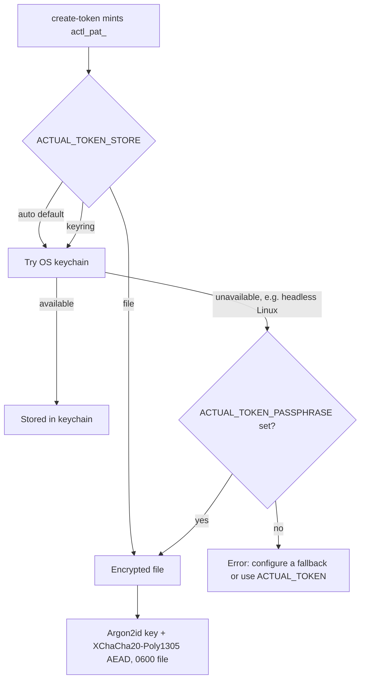

# Scoped access tokens for non-interactive use

`actual login` signs you in through the browser. That's fine for a person at a
keyboard. A CI job or an autonomous agent has no browser to click through,
though, and that's the gap `actual auth create-token` closes: it mints a
**scoped personal access token** (PAT) from your existing login session, so
headless callers authenticate without one.

> **Status: prototype.** This command is a proof of concept. The issuance
> endpoint it calls is being finalized on the server; the CLI is built against
> the documented contract and is repointed with a single flag or environment
> variable once the endpoint ships. See [Endpoint](#endpoint) below.

## Mint a token

```console
$ actual login                       # once, interactively, in a browser
$ actual auth create-token --name ci-deploy --scopes adr:query,adr:review
✔ Created scoped access token "ci-deploy"
  Token id:    tok_9f3c
  Scopes:      adr:query adr:review
  Stored in:   OS keychain

Your token is shown once below. Copy it now:

actl_pat_xxxxxxxxxxxxxxxxxxxxxxxxxxxx

Keep this secret safe:
  • Use a DEDICATED token per agent so actions are attributable and
    individually revocable; never reuse your interactive login session.
  • NEVER paste it into a prompt, commit it, or echo it to logs/history.
  • For CI / non-interactive use, pass it via the ACTUAL_TOKEN env var.
```

The raw `actl_pat_…` value is printed **once**, to stdout, on its own line, so
`TOKEN=$(actual auth create-token …)` captures just the secret. After that it
lives only behind the OS keychain, or the encrypted-file fallback described
below. It never reaches a log. Copy it now, because there's no second chance to
read it back out in the clear.

`--name` is required and `--scopes` takes a comma- or space-separated list.

## Two rules for agents

These two rules aren't optional hardening. They're the difference between a
credential you can reason about and one you can't.

### 1. A dedicated token per agent

Mint a **separate** token for each agent instance, named after that agent
(`--name <agent>`). Never hand an agent the human's interactive login session.

One token per agent buys two things. Every action an agent takes is attributable
to that agent's token rather than to a shared identity. And when one agent
misbehaves or its host is compromised, you revoke that single token without
disturbing every other agent and every human session.

### 2. The token never enters the model's context

A PAT lives in exactly one of two places. Those are the OS keychain, or the
`ACTUAL_TOKEN` environment variable for a non-interactive run. It must **never**
appear in:

- an agent's prompt or conversation context,
- the shell history,
- a command-line argument that other processes can read,
- a log line or an error report.

The failure mode this guards against is specific to agents. An agent reads
untrusted input: a web page, a file, a tool result. A prompt-injection payload
hidden in that input can instruct the agent to exfiltrate any secret currently
in its context. A token that is never in the context cannot be exfiltrated that
way. Keep the secret in the keychain, or in an environment variable the model
does not read, and that attack has nothing to reach.

## Non-interactive use

A headless caller resolves its token in this order:

1. the `ACTUAL_TOKEN` environment variable, which is the CI path and needs no
   storage;
2. the OS keychain;
3. the encrypted-file fallback.

```console
# CI: inject the secret as a masked environment variable, never echoed.
$ export ACTUAL_TOKEN="actl_pat_…"     # from your CI secret store
$ actual advisor "why is the build failing?"
```

In CI, pass the token through the platform's secret store as `ACTUAL_TOKEN`. Do
not re-mint a token on every run, and do not write it to a file the job logs.

## Storage



The primary store is the OS keychain (macOS Keychain, Windows Credential
Manager, or the Linux kernel keyutils keyring), reached through the portable
[`keyring`](https://crates.io/crates/keyring) crate.

Where no keychain is available, an **encrypted-file fallback** keeps the token at
rest under the config directory. The file is sealed with XChaCha20-Poly1305,
keyed by Argon2id over a passphrase read from `ACTUAL_TOKEN_PASSPHRASE`, and
written `0600`. No passphrase, no fallback. The CLI refuses rather than write
anything weaker, so a token is never stored in a form softer than the keychain.

| Environment variable | Purpose |
| --- | --- |
| `ACTUAL_TOKEN` | A ready-to-use token for a non-interactive run; wins over stored credentials. |
| `ACTUAL_TOKEN_STORE` | Backend select: `auto` (default), `keyring`, or `file`. |
| `ACTUAL_TOKEN_PASSPHRASE` | Passphrase that seals the encrypted-file fallback. |

## Headless-storage finding

The question this prototype set out to answer: does the keychain library degrade
gracefully on a headless Linux box or CI runner with no desktop keyring?

The first cut used the `keyring` crate's **Secret Service** backend
(`sync-secret-service`), and the finding was sharper than expected. Secret
Service does not fail gracefully at runtime here; it fails at **build time**.
That backend links the system `libdbus` through `pkg-config`, so a host without
`libdbus-1-dev` cannot compile the CLI at all. On stock Linux CI runners every
job went red on `The system library dbus-1 required by crate libdbus-sys was not
found`, across build, lint, test, and coverage alike. A missing runtime daemon
is recoverable. A binary that never builds is not.

The fix is to pick a Linux backend with no build-time system dependency. This
CLI now uses `linux-native`, the kernel **keyutils** keyring, reached through raw
syscalls: no `libdbus`, no `pkg-config`, no D-Bus daemon. It compiles on any
Linux, including a bare CI container, and it stores secrets headless without a
desktop session. macOS and Windows keep their native keychains (`apple-native`,
`windows-native`), which never had the problem.

Runtime degradation is still handled explicitly. In the default `auto` mode a
keychain error routes to the encrypted-file store **when a passphrase is
configured**, and otherwise fails loudly with a message pointing at
`ACTUAL_TOKEN` or `ACTUAL_TOKEN_PASSPHRASE`. The CLI never invents a weaker store
behind your back. Silent degradation would leave a token written somewhere
unprotected, and that is the outcome worth avoiding.

One property of keyutils is worth knowing. Kernel keyrings are scoped to a
session or the persistent per-user keyring, so a secret there is less durable
across reboots than a Secret Service entry on a desktop. For durable
non-interactive use that does not matter, because the recommended paths avoid the
OS keychain entirely:

- **CI**: pass `ACTUAL_TOKEN` from the platform's secret store. Nothing is
  written to disk.
- **Headless Linux that must persist a token**: set `ACTUAL_TOKEN_PASSPHRASE` to
  enable the encrypted-file fallback, which survives reboots at `0600`.
- **Interactive desktop** (macOS, Windows, Linux with keyutils): the OS keychain
  is used with no extra configuration.

### Prototype limitations

- The endpoint contract is provisional; see below.
- The encrypted-file fallback derives its key from a passphrase. Treat that
  passphrase as a secret of the same weight as the token, and supply a
  high-entropy value (the Argon2id work factor slows brute force but cannot
  rescue a guessable passphrase).

## Endpoint

`create-token` calls `POST <base>/api/oauth/tokens` with the login session token
as the bearer, and reads back the minted `actl_pat_…`. The base URL is resolved
from `--api-url`, then the `ACTUAL_API_URL` environment variable, then the
api-service default, so a local mock or a future production path needs no code
change. It isn't final yet. Until the server endpoint ships, treat the exact
path and payload as provisional.
