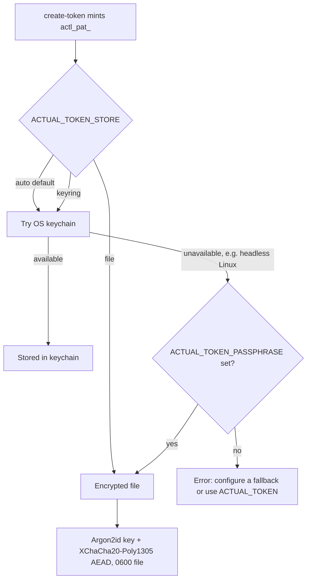

# Scoped access tokens for non-interactive use

`actual login` signs you in through the browser. That's fine for a person at a
keyboard. A CI job or an autonomous agent has no browser to click through,
though, and that's the gap `actual auth create-token` closes: it mints a
**scoped personal access token** (PAT) from your existing login session, so
headless callers authenticate without one.

> **Status: prototype.** This command is a proof of concept. The issuance
> endpoint it calls is being finalized on the server; the CLI is built against
> the documented contract and is repointed with a single flag or environment
> variable once the endpoint ships. See [Endpoint](#endpoint-create-token)
> below.

## Two headless paths

Which one you want depends on whether a human ever logs in.

- **`actual auth create-token`** derives a PAT from *your* browser login. It
  carries a subset of that person's access into CI, and it's what the rest of
  this page describes until the last section.
- **`actual mint-token`** needs no login at all. An agent holds a registered
  private key, signs a short-lived assertion with it, and trades that for an
  access token. See [Service-account keys](#service-account-keys).

## Mint a token

```console
$ actual login                       # once, interactively, in a browser
$ actual auth create-token --name ci-deploy --scopes adr:query,adr:review
✔ Created scoped access token "ci-deploy"
  Token id:    tok_9f3c
  Scopes:      adr:query adr:review
  Stored in:   OS keychain

Your token is shown once below. Copy it now:

actl_pat_xxxxxxxxxxxxxxxxxxxxxxxxxxxx

Keep this secret safe:
  • Use a DEDICATED token per agent so actions are attributable and
    individually revocable; never reuse your interactive login session.
  • NEVER paste it into a prompt, commit it, or echo it to logs/history.
  • For CI / non-interactive use, pass it via the ACTUAL_TOKEN env var.
```

The raw `actl_pat_…` value is printed **once**, to stdout, on its own line, so
`TOKEN=$(actual auth create-token …)` captures just the secret. After that it
lives only behind the OS keychain, or the encrypted-file fallback described
below. It never reaches a log. Copy it now, because there's no second chance to
read it back out in the clear.

`--name` is required and `--scopes` takes a comma- or space-separated list.

## Two rules for agents

These two rules aren't optional hardening. They're the difference between a
credential you can reason about and one you can't.

### 1. A dedicated token per agent

Mint a **separate** token for each agent instance, named after that agent
(`--name <agent>`). Never hand an agent the human's interactive login session.

One token per agent buys two things. Every action an agent takes is attributable
to that agent's token rather than to a shared identity. And when one agent
misbehaves or its host is compromised, you revoke that single token without
disturbing every other agent and every human session.

### 2. The token never enters the model's context

A PAT lives in exactly one of two places. Those are the OS keychain, or the
`ACTUAL_TOKEN` environment variable for a non-interactive run. It must **never**
appear in:

- an agent's prompt or conversation context,
- the shell history,
- a command-line argument that other processes can read,
- a log line or an error report.

The failure mode this guards against is specific to agents. An agent reads
untrusted input: a web page, a file, a tool result. A prompt-injection payload
hidden in that input can instruct the agent to exfiltrate any secret currently
in its context. A token that is never in the context cannot be exfiltrated that
way. Keep the secret in the keychain, or in an environment variable the model
does not read, and that attack has nothing to reach.

## Non-interactive use

A headless caller resolves its token in this order:

1. the `ACTUAL_TOKEN` environment variable, which is the CI path and needs no
   storage;
2. the OS keychain;
3. the encrypted-file fallback.

```console
# CI: inject the secret as a masked environment variable, never echoed.
$ export ACTUAL_TOKEN="actl_pat_…"     # from your CI secret store
$ actual advisor "why is the build failing?"
```

In CI, pass the token through the platform's secret store as `ACTUAL_TOKEN`. Do
not re-mint a token on every run, and do not write it to a file the job logs.
That re-mint advice is about `create-token` PATs. With `mint-token` you mint
once per job instead; see [Service-account keys](#service-account-keys).

## Storage


```mermaid
flowchart TD
    A[create-token mints actl_pat_] --> B{ACTUAL_TOKEN_STORE}
    B -->|auto default| C[Try OS keychain]
    B -->|keyring| C
    B -->|file| F[Encrypted file]
    C -->|available| D[Stored in keychain]
    C -->|unavailable, e.g. headless Linux| E{ACTUAL_TOKEN_PASSPHRASE set?}
    E -->|yes| F
    E -->|no| G[Error: configure a fallback or use ACTUAL_TOKEN]
    F --> H[Argon2id key + XChaCha20-Poly1305 AEAD, 0600 file]
```

The primary store is the OS keychain (macOS Keychain, Windows Credential
Manager, or the Linux kernel keyutils keyring), reached through the portable
[`keyring`](https://crates.io/crates/keyring) crate.

Where no keychain is available, an **encrypted-file fallback** keeps the token at
rest under the config directory. The file is sealed with XChaCha20-Poly1305,
keyed by Argon2id over a passphrase read from `ACTUAL_TOKEN_PASSPHRASE`, and
written `0600`. No passphrase, no fallback. The CLI refuses rather than write
anything weaker, so a token is never stored in a form softer than the keychain.

| Environment variable | Purpose |
| --- | --- |
| `ACTUAL_TOKEN` | A ready-to-use token for a non-interactive run; wins over stored credentials. |
| `ACTUAL_TOKEN_STORE` | Backend select: `auto` (default), `keyring`, or `file`. |
| `ACTUAL_TOKEN_PASSPHRASE` | Passphrase that seals the encrypted-file fallback. |

## Headless-storage finding

The question this prototype set out to answer: does the keychain library degrade
gracefully on a headless Linux box or CI runner with no desktop keyring?

The first cut used the `keyring` crate's **Secret Service** backend
(`sync-secret-service`), and the finding was sharper than expected. Secret
Service does not fail gracefully at runtime here; it fails at **build time**.
That backend links the system `libdbus` through `pkg-config`, so a host without
`libdbus-1-dev` cannot compile the CLI at all. On stock Linux CI runners every
job went red on `The system library dbus-1 required by crate libdbus-sys was not
found`, across build, lint, test, and coverage alike. A missing runtime daemon
is recoverable. A binary that never builds is not.

The fix is to pick a Linux backend with no build-time system dependency. This
CLI now uses `linux-native`, the kernel **keyutils** keyring, reached through raw
syscalls: no `libdbus`, no `pkg-config`, no D-Bus daemon. It compiles on any
Linux, including a bare CI container, and it stores secrets headless without a
desktop session. macOS and Windows keep their native keychains (`apple-native`,
`windows-native`), which never had the problem.

Runtime degradation is still handled explicitly. In the default `auto` mode a
keychain error routes to the encrypted-file store **when a passphrase is
configured**, and otherwise fails loudly with a message pointing at
`ACTUAL_TOKEN` or `ACTUAL_TOKEN_PASSPHRASE`. The CLI never invents a weaker store
behind your back. Silent degradation would leave a token written somewhere
unprotected, and that is the outcome worth avoiding.

One property of keyutils is worth knowing. Kernel keyrings are scoped to a
session or the persistent per-user keyring, so a secret there is less durable
across reboots than a Secret Service entry on a desktop. For durable
non-interactive use that does not matter, because the recommended paths avoid the
OS keychain entirely:

- **CI**: pass `ACTUAL_TOKEN` from the platform's secret store. Nothing is
  written to disk.
- **Headless Linux that must persist a token**: set `ACTUAL_TOKEN_PASSPHRASE` to
  enable the encrypted-file fallback, which survives reboots at `0600`.
- **Interactive desktop** (macOS, Windows, Linux with keyutils): the OS keychain
  is used with no extra configuration.

### Prototype limitations

- The endpoint contract is provisional; see below.
- The encrypted-file fallback derives its key from a passphrase. Treat that
  passphrase as a secret of the same weight as the token, and supply a
  high-entropy value (the Argon2id work factor slows brute force but cannot
  rescue a guessable passphrase).

## Endpoint (create-token)

`create-token` calls `POST <base>/api/oauth/tokens` with the login session token
as the bearer, and reads back the minted `actl_pat_…`. The base URL is resolved
from `--api-url`, then the `ACTUAL_API_URL` environment variable, then the
api-service default, so a local mock or a future production path needs no code
change. It isn't final yet. Until the server endpoint ships, treat the exact
path and payload as provisional.

## Service-account keys

`create-token` still assumes a human logged in once. `mint-token` removes even
that. An agent holds a private key whose public half is registered server-side,
signs a short-lived assertion with it, and exchanges the assertion for an access
token. No browser, no prompt, nothing interactive. This is the
[RFC 7523](https://datatracker.ietf.org/doc/html/rfc7523) jwt-bearer grant, and
it's the path for a long-running unattended agent.

```console
$ export ACTUAL_SERVICE_ACCOUNT_KEY="$(cat service-account.pk8.pem)"
$ TOKEN=$(actual mint-token \
    --service-account-id 6f1d9c30-4b21-4f83-9f0c-2a7b5d8e1c44 \
    --kid sa-2026-08 \
    --scope adr:query --scope adr:review)
mint-token minting a token via jwt-bearer (ES256) as 6f1d9c30-…
✔ minted token (expires in 3600s; scope: adr:query adr:review)
```

The capture contract matches `create-token`: the access token is the **only**
thing written to stdout, so `TOKEN=$(actual mint-token …)` captures exactly the
token and nothing else. Status lines go to stderr, and the token never appears
there. Pass `--json` when you want the full response (`expires_in`, the granted
scope) as one machine-readable line on stdout instead.

`--service-account-id` (a UUID) and `--kid` are both required. The key id tells
the server which registered public key to verify against, so it has to name the
key you're actually signing with.

### Supplying the key

Two environment variables carry the key, and a key file wins when both are set:

| Environment variable | Purpose |
| --- | --- |
| `ACTUAL_SERVICE_ACCOUNT_KEY` | The PEM contents inline. Preferred with a secret manager: the key reaches the process without touching disk. |
| `ACTUAL_SERVICE_ACCOUNT_KEY_FILE` | Path to a PEM file. `--key <PATH>` is the flag form of the same thing. |

There's deliberately no flag that takes the key material itself. A
command-line argument is readable by every other process on the box and it
lands in shell history, which is the one place a signing key must never be.

Treat the private key as strictly more sensitive than a PAT. A leaked PAT is
revoked one token at a time. A leaked service-account key keeps minting fresh
tokens until someone rotates the registered public key.

### EC keys must be PKCS#8

An EC (P-256) key has to be PKCS#8, the PEM that opens with `BEGIN PRIVATE
KEY`. Nothing exotic, just the newer of the two encodings. The older SEC1 encoding (`BEGIN EC PRIVATE KEY`), which is what
`openssl ecparam -genkey` writes by default, is refused before anything is
signed:

```console
$ actual mint-token --key sec1.pem --service-account-id <uuid> --kid <kid>
Error: SEC1 EC private key ('BEGIN EC PRIVATE KEY'); PKCS#8 is required
Fix: openssl pkcs8 -topk8 -nocrypt -in <key.pem> -out <key.pk8.pem>
```

Convert once and point at the result:

```bash
openssl pkcs8 -topk8 -nocrypt -in sec1.pem -out service-account.pk8.pem
```

The conversion re-encodes the same key pair, so the registered public key is
untouched and `--kid` stays as it was. You get the same refusal and the same
fix whether the algorithm was inferred from the key or you passed `--alg es256`
yourself. RSA keys carry no equivalent restriction: PKCS#1 (`BEGIN RSA PRIVATE
KEY`) and PKCS#8 both load.

The refusal is a deliberate choice rather than a gap to work around. The
signer this CLI pins
cannot load a SEC1 key at all, so accepting one would only move the failure
later, to signing time, where the error no longer names the key format. Failing
at the door with the conversion command attached is the more useful answer.

### Algorithm, lifetime, and audience

`--alg` is inferred from the key, with EC signing ES256 and RSA signing RS256.
Pass it explicitly only to pin what you expect. Just `rs256` and `es256` are
accepted; `HS*` and `none` are refused outright, so the client cannot be talked
into emitting a symmetric or unsigned assertion.

`--assertion-ttl-seconds` bounds the assertion rather than the token the server
returns. It defaults to 60 and is capped at 300. That short window plus a fresh
`jti` on every call is what makes a captured assertion close to useless: the
server anti-replays on the `jti`, and the assertion expires in a minute anyway.

`--issuer` sets the authorization server base URL, resolved from the flag, then
`ACTUAL_AUTH_URL`, then the production default. The token endpoint is
`<issuer>/api/oauth/token`. `--aud` overrides the assertion audience, which
otherwise follows the issuer origin. A non-HTTPS, non-loopback issuer is
rejected before any assertion leaves the process.

`--scope` is repeatable and asks for a subset of the principal's grant. Omit it
and the server mints the principal's full whitelist.

### In CI

```yaml
- name: Mint a service-account token
  env:
    ACTUAL_SERVICE_ACCOUNT_KEY: ${{ secrets.ACTUAL_SERVICE_ACCOUNT_KEY }}
    ACTUAL_SERVICE_ACCOUNT_ID: ${{ secrets.ACTUAL_SERVICE_ACCOUNT_ID }}
    ACTUAL_SERVICE_ACCOUNT_KID: ${{ vars.ACTUAL_SERVICE_ACCOUNT_KID }}
  run: |
    TOKEN=$(actual mint-token --scope adr:query)
    echo "::add-mask::$TOKEN"
    echo "ACTUAL_TOKEN=$TOKEN" >> "$GITHUB_ENV"
```

The three required inputs (the id, the key id, and the key) all have
environment-variable forms, so a CI step passes arguments only for what it
wants to vary. Mint per job instead of storing a token:
the assertion costs nothing, the token is short-lived, and the only long-lived
secret is the key sitting in the secret store. Mask the minted token before it
can reach a log, as the `add-mask` line does, because a token minted at runtime
is not one of the secrets the platform already knows to redact.
