# actual-cli Architecture Specification

| Field   | Value                          |
|---------|--------------------------------|
| Version | 1.0                            |
| Date    | 2026-03-02                     |
| Scope   | Full system architecture for `actual-cli` |

---

## Table of Contents

- [1. System Overview](#1-system-overview)
- [2. Data Model](#2-data-model)
- [3. CLI Command Dispatch](#3-cli-command-dispatch)
- [4. Command Flows](#4-command-flows)
  - [4.1 actual adr-bot — Main Sync Pipeline](#41-actual-adr-bot--main-sync-pipeline)
  - [4.2 actual status](#42-actual-status)
  - [4.3 actual auth](#43-actual-auth)
  - [4.4 actual config](#44-actual-config)
  - [4.5 actual runners](#45-actual-runners)
  - [4.6 actual models](#46-actual-models)
  - [4.7 actual cache clear](#47-actual-cache-clear)
- [5. Runner Selection and Wiring](#5-runner-selection-and-wiring)
- [6. Analysis Pipeline](#6-analysis-pipeline)
- [7. Tailoring Pipeline](#7-tailoring-pipeline)
- [8. Output Generation and Merge](#8-output-generation-and-merge)
- [9. API Client](#9-api-client)
- [10. Data Flow (End-to-End)](#10-data-flow-end-to-end)
- [11. Configuration Resolution](#11-configuration-resolution)
- [12. Error Handling and Exit Codes](#12-error-handling-and-exit-codes)
- [13. UI Architecture](#13-ui-architecture)

---

## 1. System Overview

The `actual-cli` is a Rust CLI application that fetches Architecture Decision Records (ADRs) from the Actual AI API, tailors them to a repository's technology stack using LLM runners, and writes managed output files (`CLAUDE.md`, `AGENTS.md`, or `.cursor/rules/actual-policies.mdc`).

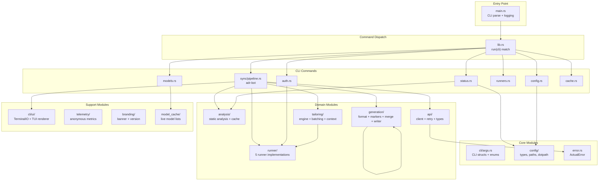
```mermaid
flowchart TB
    subgraph Entry["Entry Point"]
        main["main.rs<br/>CLI parse + logging"]
    end

    subgraph Dispatch["Command Dispatch"]
        lib["lib.rs<br/>run(cli) match"]
    end

    subgraph Commands["CLI Commands"]
        sync["sync/pipeline.rs<br/>adr-bot"]
        status["status.rs"]
        auth["auth.rs"]
        config_cmd["config.rs"]
        runners_cmd["runners.rs"]
        models_cmd["models.rs"]
        cache_cmd["cache.rs"]
    end

    subgraph Core["Core Modules"]
        cli_args["cli/args.rs<br/>CLI structs + enums"]
        config_mod["config/<br/>types, paths, dotpath"]
        error_mod["error.rs<br/>ActualError"]
    end

    subgraph Domain["Domain Modules"]
        analysis["analysis/<br/>static analysis + cache"]
        api["api/<br/>client + retry + types"]
        tailoring["tailoring/<br/>engine + batching + context"]
        generation["generation/<br/>format + markers + merge + writer"]
        runner["runner/<br/>5 runner implementations"]
    end

    subgraph Support["Support Modules"]
        ui["cli/ui/<br/>TerminalIO + TUI renderer"]
        telemetry["telemetry/<br/>anonymous metrics"]
        branding["branding/<br/>banner + version"]
        model_cache["model_cache/<br/>live model lists"]
    end

    main --> lib
    lib --> sync
    lib --> status
    lib --> auth
    lib --> config_cmd
    lib --> runners_cmd
    lib --> models_cmd
    lib --> cache_cmd

    sync --> analysis
    sync --> api
    sync --> tailoring
    sync --> generation
    sync --> runner
    sync --> ui

    status --> config_mod
    status --> analysis
    auth --> runner
    config_cmd --> config_mod
    models_cmd --> model_cache

    tailoring --> runner
    generation --> generation
    api --> error_mod
```

---

## 2. Data Model

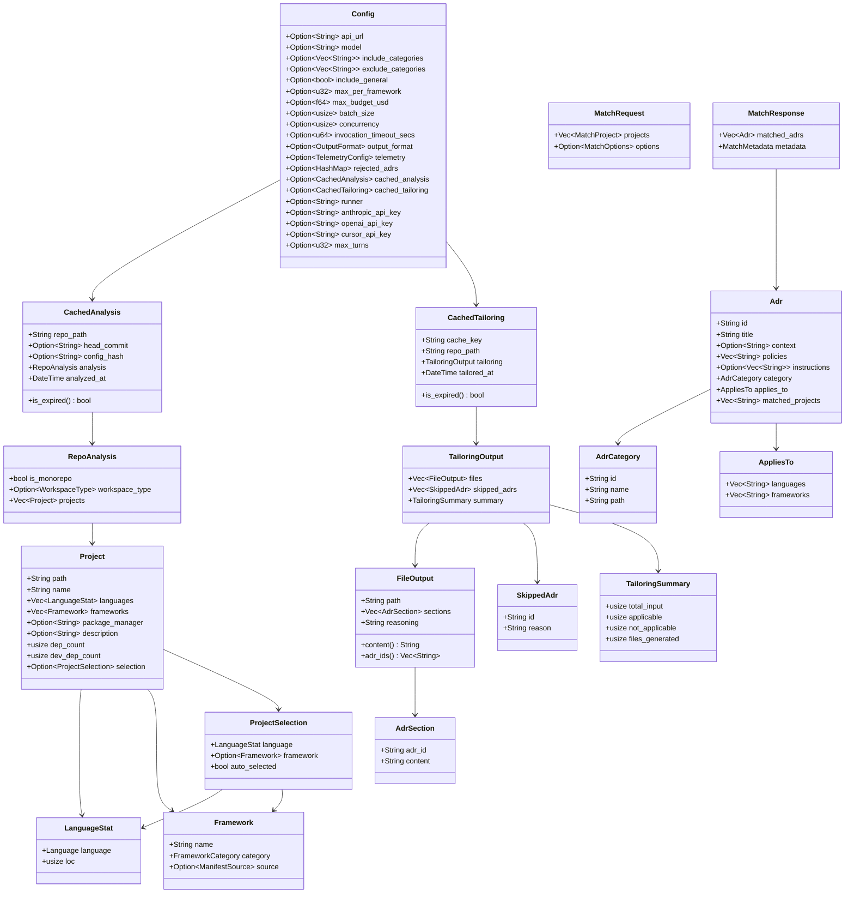
```mermaid
classDiagram
    class Config {
        +Option~String~ api_url
        +Option~String~ model
        +Option~Vec~String~~ include_categories
        +Option~Vec~String~~ exclude_categories
        +Option~bool~ include_general
        +Option~u32~ max_per_framework
        +Option~f64~ max_budget_usd
        +Option~usize~ batch_size
        +Option~usize~ concurrency
        +Option~u64~ invocation_timeout_secs
        +Option~OutputFormat~ output_format
        +Option~TelemetryConfig~ telemetry
        +Option~HashMap~ rejected_adrs
        +Option~CachedAnalysis~ cached_analysis
        +Option~CachedTailoring~ cached_tailoring
        +Option~String~ runner
        +Option~String~ anthropic_api_key
        +Option~String~ openai_api_key
        +Option~String~ cursor_api_key
        +Option~u32~ max_turns
    }

    class CachedAnalysis {
        +String repo_path
        +Option~String~ head_commit
        +Option~String~ config_hash
        +RepoAnalysis analysis
        +DateTime analyzed_at
        +is_expired() bool
    }

    class CachedTailoring {
        +String cache_key
        +String repo_path
        +TailoringOutput tailoring
        +DateTime tailored_at
        +is_expired() bool
    }

    class RepoAnalysis {
        +bool is_monorepo
        +Option~WorkspaceType~ workspace_type
        +Vec~Project~ projects
    }

    class Project {
        +String path
        +String name
        +Vec~LanguageStat~ languages
        +Vec~Framework~ frameworks
        +Option~String~ package_manager
        +Option~String~ description
        +usize dep_count
        +usize dev_dep_count
        +Option~ProjectSelection~ selection
    }

    class LanguageStat {
        +Language language
        +usize loc
    }

    class Framework {
        +String name
        +FrameworkCategory category
        +Option~ManifestSource~ source
    }

    class ProjectSelection {
        +LanguageStat language
        +Option~Framework~ framework
        +bool auto_selected
    }

    class Adr {
        +String id
        +String title
        +Option~String~ context
        +Vec~String~ policies
        +Option~Vec~String~~ instructions
        +AdrCategory category
        +AppliesTo applies_to
        +Vec~String~ matched_projects
    }

    class AdrCategory {
        +String id
        +String name
        +String path
    }

    class AppliesTo {
        +Vec~String~ languages
        +Vec~String~ frameworks
    }

    class TailoringOutput {
        +Vec~FileOutput~ files
        +Vec~SkippedAdr~ skipped_adrs
        +TailoringSummary summary
    }

    class FileOutput {
        +String path
        +Vec~AdrSection~ sections
        +String reasoning
        +content() String
        +adr_ids() Vec~String~
    }

    class AdrSection {
        +String adr_id
        +String content
    }

    class SkippedAdr {
        +String id
        +String reason
    }

    class TailoringSummary {
        +usize total_input
        +usize applicable
        +usize not_applicable
        +usize files_generated
    }

    class MatchRequest {
        +Vec~MatchProject~ projects
        +Option~MatchOptions~ options
    }

    class MatchResponse {
        +Vec~Adr~ matched_adrs
        +MatchMetadata metadata
    }

    Config --> CachedAnalysis
    Config --> CachedTailoring
    CachedAnalysis --> RepoAnalysis
    CachedTailoring --> TailoringOutput
    RepoAnalysis --> Project
    Project --> LanguageStat
    Project --> Framework
    Project --> ProjectSelection
    ProjectSelection --> LanguageStat
    ProjectSelection --> Framework
    Adr --> AdrCategory
    Adr --> AppliesTo
    TailoringOutput --> FileOutput
    TailoringOutput --> SkippedAdr
    TailoringOutput --> TailoringSummary
    FileOutput --> AdrSection
    MatchResponse --> Adr
```

### Key Enums

| Enum | Variants |
|------|----------|
| `Language` | `TypeScript`, `JavaScript`, `Python`, `Rust`, `Go`, `Java`, `Kotlin`, `Swift`, `Ruby`, `Php`, `C`, `Cpp`, `CSharp`, `Scala`, `Elixir`, `Other(String)` |
| `FrameworkCategory` | `WebFrontend`, `WebBackend`, `Mobile`, `Desktop`, `Cli`, `Library`, `Data`, `Ml`, `Devops`, `Testing`, `BuildSystem`, `Other(String)` |
| `WorkspaceType` | `Pnpm`, `Npm`, `Yarn`, `Lerna`, `Nx`, `Cargo`, `Go` |
| `OutputFormat` | `ClaudeMd` ("claude-md"), `AgentsMd` ("agents-md"), `CursorRules` ("cursor-rules") |
| `RunnerChoice` | `ClaudeCli`, `AnthropicApi`, `OpenAiApi`, `CodexCli`, `CursorCli` |

---

## 3. CLI Command Dispatch

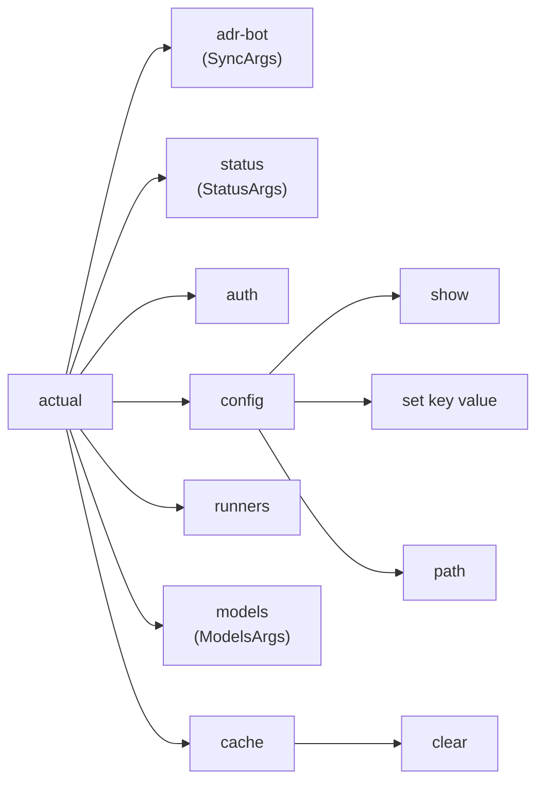
```mermaid
flowchart LR
    actual["actual"]

    actual --> adr_bot["adr-bot<br/>(SyncArgs)"]
    actual --> status_cmd["status<br/>(StatusArgs)"]
    actual --> auth_cmd["auth"]
    actual --> config_top["config"]
    actual --> runners_top["runners"]
    actual --> models_top["models<br/>(ModelsArgs)"]
    actual --> cache_top["cache"]

    config_top --> show["show"]
    config_top --> set["set key value"]
    config_top --> path["path"]

    cache_top --> clear["clear"]
```

| Command | Handler | Args Struct |
|---------|---------|-------------|
| `actual adr-bot` | `cli::commands::sync::exec` | `SyncArgs` |
| `actual status` | `cli::commands::status::exec` | `StatusArgs` |
| `actual auth` | `cli::commands::auth::exec` | (none) |
| `actual config show\|set\|path` | `cli::commands::config::exec` | `ConfigArgs` → `ConfigAction` |
| `actual runners` | `cli::commands::runners::exec` | (none) |
| `actual models` | `cli::commands::models::exec` | `ModelsArgs` |
| `actual cache clear` | `cli::commands::cache::exec` | `CacheArgs` → `CacheAction` |

---

## 4. Command Flows

### 4.1 actual adr-bot — Main Sync Pipeline

The sync pipeline executes five phases in sequence. Each phase is tracked by the `TuiRenderer` with spinner/status indicators.

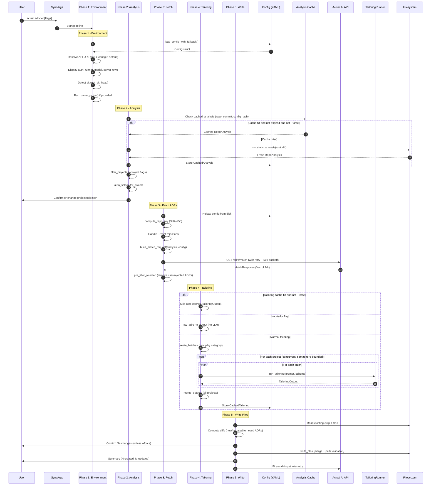
```mermaid
sequenceDiagram
    autonumber
    participant User
    participant CLI as SyncArgs
    participant Env as Phase 1: Environment
    participant Ana as Phase 2: Analysis
    participant Fetch as Phase 3: Fetch
    participant Tail as Phase 4: Tailoring
    participant Write as Phase 5: Write
    participant Config as Config (YAML)
    participant Cache as Analysis Cache
    participant API as Actual AI API
    participant Runner as TailoringRunner
    participant FS as Filesystem

    User ->> CLI: actual adr-bot [flags]
    CLI ->> Env: Start pipeline

    Note over Env: Phase 1 - Environment
    Env ->> Config: load_config_with_fallback()
    Config -->> Env: Config struct
    Env ->> Env: Resolve API URL (CLI > config > default)
    Env ->> Env: Display auth, runner, model, server rows
    Env ->> Env: Detect git (get_git_head)
    Env ->> Env: Run runner_probe() if provided

    Note over Ana: Phase 2 - Analysis
    Ana ->> Cache: Check cached_analysis (repo, commit, config hash)
    alt Cache hit and not expired and not --force
        Cache -->> Ana: Cached RepoAnalysis
    else Cache miss
        Ana ->> FS: run_static_analysis(root_dir)
        FS -->> Ana: Fresh RepoAnalysis
        Ana ->> Config: Store CachedAnalysis
    end
    Ana ->> Ana: filter_projects (--project flags)
    Ana ->> Ana: auto_select_for_project
    Ana ->> User: Confirm or change project selection

    Note over Fetch: Phase 3 - Fetch ADRs
    Fetch ->> Config: Reload config from disk
    Fetch ->> Fetch: compute_repo_key (SHA-256)
    Fetch ->> Fetch: Handle --reset-rejections
    Fetch ->> Fetch: build_match_request(analysis, config)
    Fetch ->> API: POST /adrs/match (with retry + 503 backoff)
    API -->> Fetch: MatchResponse (Vec of Adr)
    Fetch ->> Fetch: pre_filter_rejected (remove user-rejected ADRs)

    Note over Tail: Phase 4 - Tailoring
    alt Tailoring cache hit and not --force
        Tail ->> Tail: Skip (use cached TailoringOutput)
    else --no-tailor flag
        Tail ->> Tail: raw_adrs_to_output (no LLM)
    else Normal tailoring
        Tail ->> Tail: create_batches (group by category)
        loop For each project (concurrent, semaphore-bounded)
            loop For each batch
                Tail ->> Runner: run_tailoring(prompt, schema)
                Runner -->> Tail: TailoringOutput
            end
        end
        Tail ->> Tail: merge_outputs (all projects)
        Tail ->> Config: Store CachedTailoring
    end

    Note over Write: Phase 5 - Write Files
    Write ->> FS: Read existing output files
    Write ->> Write: Compute diffs (new/updated/removed ADRs)
    Write ->> User: Confirm file changes (unless --force)
    Write ->> FS: write_files (merge + path validation)
    Write ->> User: Summary (N created, M updated)
    Write ->> API: Fire-and-forget telemetry
```

**Functional Description:**

1. User invokes `actual adr-bot` with optional flags (`--model`, `--runner`, `--force`, `--dry-run`, `--no-tailor`, `--no-tui`, etc.).
2. The CLI parser constructs `SyncArgs` and dispatches to `sync_wiring::sync_run`, which resolves the runner and calls the pipeline.
3. **Phase 1 (Environment):** Loads config from `~/.actualai/actual/config.yaml`, resolves the API URL (CLI flag > config > `DEFAULT_API_URL`), displays environment rows (auth status, runner, model, server, config path, working directory), detects git for cache eligibility, and runs an optional runner probe to verify availability.
4. **Phase 2 (Analysis):** Checks the analysis cache keyed by `(repo_path, HEAD commit, config_hash)`. On cache hit (same commit, not expired, not `--force`), reuses the cached `RepoAnalysis`. On miss, runs full static analysis (monorepo detection, language detection via tokei, framework detection via registry + config files, package manager detection). Filters projects by `--project` flags, auto-selects language/framework per project, and prompts for user confirmation.
5. **Phase 3 (Fetch):** Reloads config, builds a `MatchRequest` from the analysis, and calls `POST /adrs/match` on the Actual AI API with retry and 503 backoff (10s, 30s, 60s delays). Filters out previously rejected ADRs.
6. **Phase 4 (Tailoring):** Checks the tailoring cache (keyed by ADR set, model, project paths, existing files). On miss, batches ADRs by category (respecting `batch_size`), then invokes the selected runner concurrently across projects (bounded by `concurrency` semaphore). Each batch invocation sends a prompt with project context, ADRs, and existing file content, receiving a `TailoringOutput` with per-file sections. Batch results are merged per-project, then all project outputs are merged into a single `TailoringOutput`.
7. **Phase 5 (Write):** Reads existing output files, computes per-ADR diffs (new, updated, removed sections), prompts user to confirm changes (unless `--force` or `--dry-run`), then writes files using the merge engine (surgical section-level updates or full replacement). Fires anonymous telemetry.

---

### 4.2 actual status

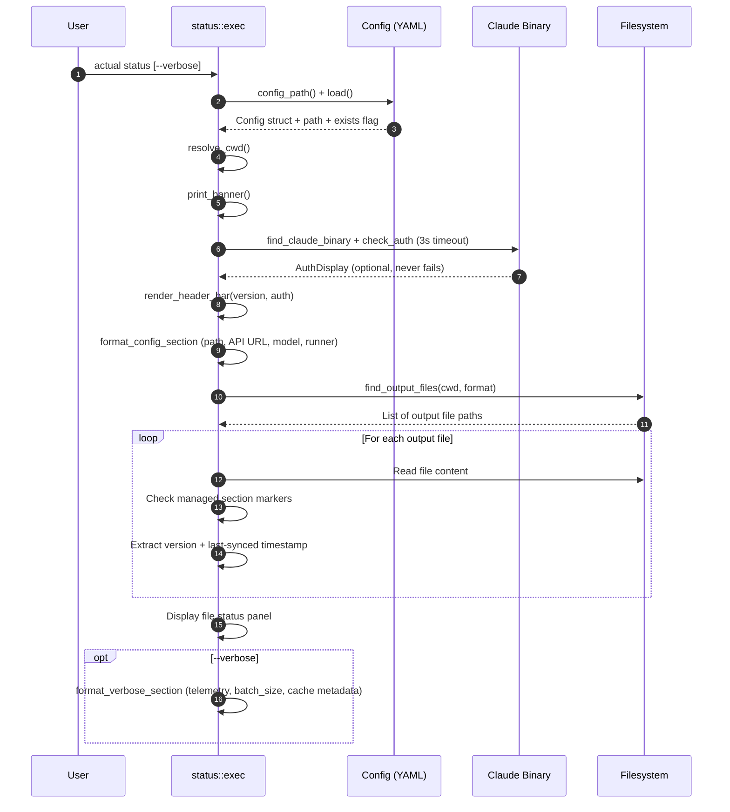
```mermaid
sequenceDiagram
    autonumber
    participant User
    participant Cmd as status::exec
    participant Config as Config (YAML)
    participant Auth as Claude Binary
    participant FS as Filesystem

    User ->> Cmd: actual status [--verbose]
    Cmd ->> Config: config_path() + load()
    Config -->> Cmd: Config struct + path + exists flag
    Cmd ->> Cmd: resolve_cwd()
    Cmd ->> Cmd: print_banner()
    Cmd ->> Auth: find_claude_binary + check_auth (3s timeout)
    Auth -->> Cmd: AuthDisplay (optional, never fails)
    Cmd ->> Cmd: render_header_bar(version, auth)
    Cmd ->> Cmd: format_config_section (path, API URL, model, runner)
    Cmd ->> FS: find_output_files(cwd, format)
    FS -->> Cmd: List of output file paths
    loop For each output file
        Cmd ->> FS: Read file content
        Cmd ->> Cmd: Check managed section markers
        Cmd ->> Cmd: Extract version + last-synced timestamp
    end
    Cmd ->> Cmd: Display file status panel
    opt --verbose
        Cmd ->> Cmd: format_verbose_section (telemetry, batch_size, cache metadata)
    end
```

**Functional Description:**

1. User invokes `actual status` with optional `--verbose` flag.
2. Loads config from the standard path; notes whether the config file pre-existed or was just created with defaults.
3. Resolves the current working directory.
4. Prints the branded banner and header bar (with auth status from a 3-second Claude binary probe that silently fails on error).
5. Displays config section: config file path (annotated "exists" or "created"), API URL (annotated "default" if unchanged), model, and optionally runner.
6. Scans the working directory for output files matching the configured format, reads each file, checks for managed section markers, and extracts version/timestamp metadata.
7. In verbose mode, additionally shows telemetry status, batch/concurrency settings, rejected ADR count, and full cached analysis metadata.

---

### 4.3 actual auth

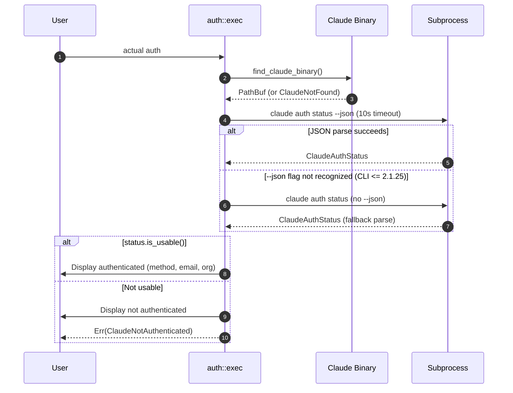
```mermaid
sequenceDiagram
    autonumber
    participant User
    participant Cmd as auth::exec
    participant Binary as Claude Binary
    participant Proc as Subprocess

    User ->> Cmd: actual auth
    Cmd ->> Binary: find_claude_binary()
    Binary -->> Cmd: PathBuf (or ClaudeNotFound)
    Cmd ->> Proc: claude auth status --json (10s timeout)
    alt JSON parse succeeds
        Proc -->> Cmd: ClaudeAuthStatus
    else --json flag not recognized (CLI <= 2.1.25)
        Cmd ->> Proc: claude auth status (no --json)
        Proc -->> Cmd: ClaudeAuthStatus (fallback parse)
    end
    alt status.is_usable()
        Cmd ->> User: Display authenticated (method, email, org)
    else Not usable
        Cmd ->> User: Display not authenticated
        Cmd -->> User: Err(ClaudeNotAuthenticated)
    end
```

**Functional Description:**

1. User invokes `actual auth`.
2. Locates the Claude binary via `CLAUDE_BINARY` env var or PATH lookup.
3. Runs `claude auth status --json` as a subprocess with a 10-second timeout.
4. Parses the JSON output into `ClaudeAuthStatus`. Falls back to non-JSON mode for older Claude CLI versions (<=2.1.25).
5. If `logged_in` is true, displays authentication details (method, email, organization). Otherwise displays an error message and returns `ClaudeNotAuthenticated`.

---

### 4.4 actual config

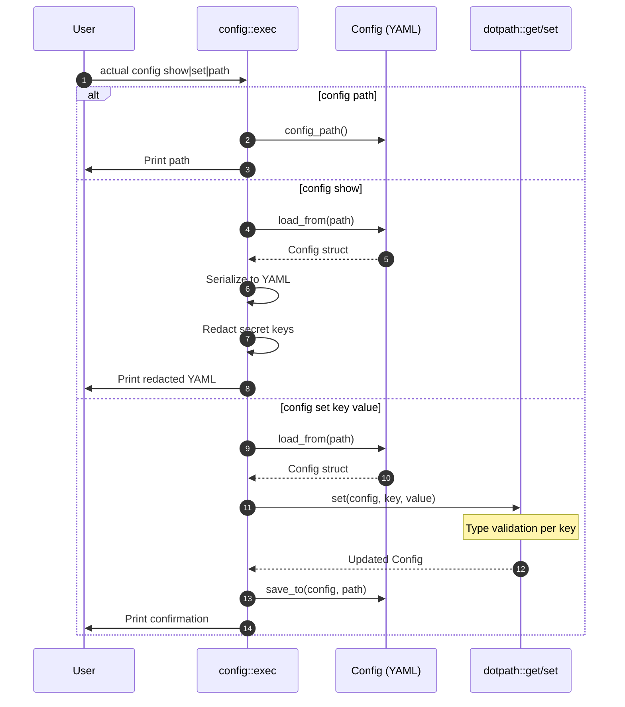
```mermaid
sequenceDiagram
    autonumber
    participant User
    participant Cmd as config::exec
    participant Config as Config (YAML)
    participant Dotpath as dotpath::get/set

    User ->> Cmd: actual config show|set|path

    alt config path
        Cmd ->> Config: config_path()
        Cmd ->> User: Print path
    else config show
        Cmd ->> Config: load_from(path)
        Config -->> Cmd: Config struct
        Cmd ->> Cmd: Serialize to YAML
        Cmd ->> Cmd: Redact secret keys
        Cmd ->> User: Print redacted YAML
    else config set key value
        Cmd ->> Config: load_from(path)
        Config -->> Cmd: Config struct
        Cmd ->> Dotpath: set(config, key, value)
        Note over Dotpath: Type validation per key
        Dotpath -->> Cmd: Updated Config
        Cmd ->> Config: save_to(config, path)
        Cmd ->> User: Print confirmation
    end
```

**Functional Description:**

1. User invokes `actual config` with a subcommand: `show`, `set <key> <value>`, or `path`.
2. **path:** Resolves and prints the config file path (`~/.actualai/actual/config.yaml` or `ACTUAL_CONFIG` override).
3. **show:** Loads config, serializes to YAML, redacts API key values (`anthropic_api_key`, `openai_api_key`, `cursor_api_key`) as `[redacted]`, and prints.
4. **set:** Loads config, calls `dotpath::set()` which validates the key name against `ConfigKey` and the value against per-key type constraints (e.g., `batch_size` must be `>= 1`, `output_format` must be one of `claude-md|agents-md|cursor-rules`). Saves the updated config.

---

### 4.5 actual runners

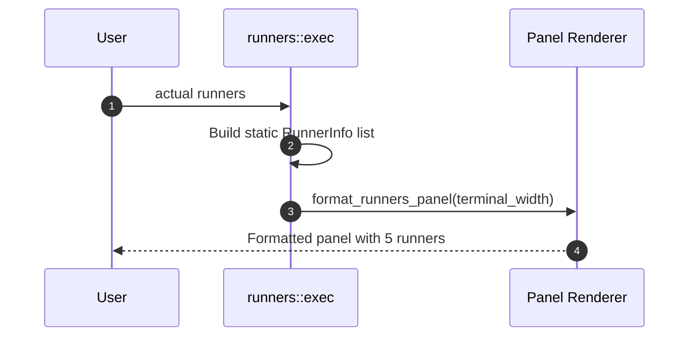
```mermaid
sequenceDiagram
    autonumber
    participant User
    participant Cmd as runners::exec
    participant UI as Panel Renderer

    User ->> Cmd: actual runners
    Cmd ->> Cmd: Build static RunnerInfo list
    Cmd ->> UI: format_runners_panel(terminal_width)
    UI -->> User: Formatted panel with 5 runners
```

**Functional Description:**

1. User invokes `actual runners`.
2. Builds a static list of five runners with their names, requirements, and descriptions.
3. Renders a formatted panel displaying:
   - `claude-cli` (requires `claude` binary) — Claude Code CLI subprocess (default)
   - `anthropic-api` (requires `ANTHROPIC_API_KEY`) — Anthropic Messages API
   - `openai-api` (requires `OPENAI_API_KEY`) — OpenAI Responses API
   - `codex-cli` (requires `codex` binary) — Codex CLI subprocess
   - `cursor-cli` (requires `agent` binary) — Cursor CLI subprocess

---

### 4.6 actual models

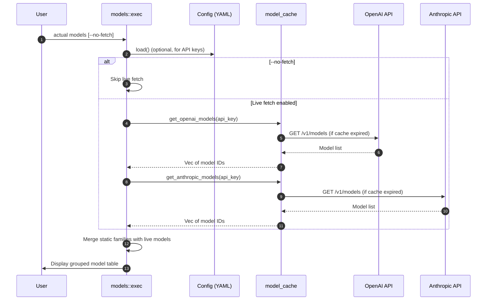
```mermaid
sequenceDiagram
    autonumber
    participant User
    participant Cmd as models::exec
    participant Config as Config (YAML)
    participant Cache as model_cache
    participant OpenAI as OpenAI API
    participant Anthropic as Anthropic API

    User ->> Cmd: actual models [--no-fetch]

    Cmd ->> Config: load() (optional, for API keys)

    alt --no-fetch
        Cmd ->> Cmd: Skip live fetch
    else Live fetch enabled
        Cmd ->> Cache: get_openai_models(api_key)
        Cache ->> OpenAI: GET /v1/models (if cache expired)
        OpenAI -->> Cache: Model list
        Cache -->> Cmd: Vec of model IDs

        Cmd ->> Cache: get_anthropic_models(api_key)
        Cache ->> Anthropic: GET /v1/models (if cache expired)
        Anthropic -->> Cache: Model list
        Cache -->> Cmd: Vec of model IDs
    end

    Cmd ->> Cmd: Merge static families with live models
    Cmd ->> User: Display grouped model table
```

**Functional Description:**

1. User invokes `actual models` with optional `--no-fetch` flag.
2. Loads config (non-fatal) to extract API keys for live model fetching.
3. Unless `--no-fetch`, queries OpenAI and Anthropic APIs for live model lists (cached with TTL).
4. Displays models grouped by runner family:
   - **Claude / Anthropic** (`claude-cli`, `anthropic-api`): default `claude-sonnet-4-6`, plus opus, haiku, legacy models, and short aliases
   - **OpenAI** (`openai-api`): default `gpt-5.2`, plus GPT and o-series models
   - **Codex CLI** (`codex-cli`): default `gpt-5.2-codex`, plus codex variants
   - **Cursor** (`cursor-cli`): default `opus-4.6-thinking`, plus auto, composer, and third-party models
5. Live models not in the static list are appended with a `(live)` annotation.

---

### 4.7 actual cache clear

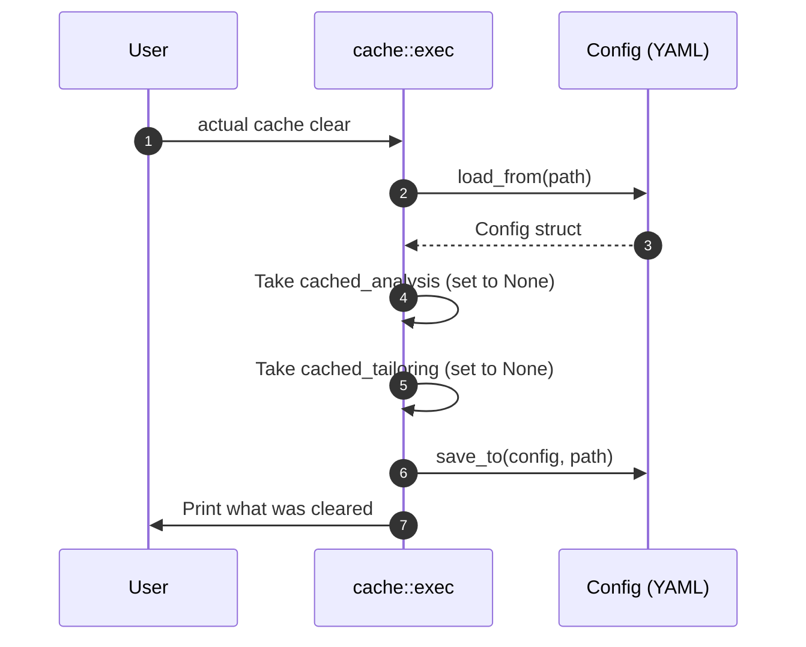
```mermaid
sequenceDiagram
    autonumber
    participant User
    participant Cmd as cache::exec
    participant Config as Config (YAML)

    User ->> Cmd: actual cache clear
    Cmd ->> Config: load_from(path)
    Config -->> Cmd: Config struct
    Cmd ->> Cmd: Take cached_analysis (set to None)
    Cmd ->> Cmd: Take cached_tailoring (set to None)
    Cmd ->> Config: save_to(config, path)
    Cmd ->> User: Print what was cleared
```

**Functional Description:**

1. User invokes `actual cache clear`.
2. Loads config from disk.
3. Removes `cached_analysis` and `cached_tailoring` fields from the config struct (sets to `None`).
4. Saves the modified config, preserving all other settings.
5. Reports what was cleared (or "No cache entries to clear" if both were already `None`).

---

## 5. Runner Selection and Wiring

Runner selection follows a three-level priority cascade. Once a runner is selected, it is wired with the appropriate credentials, model, and timeout, then handed to the sync pipeline.

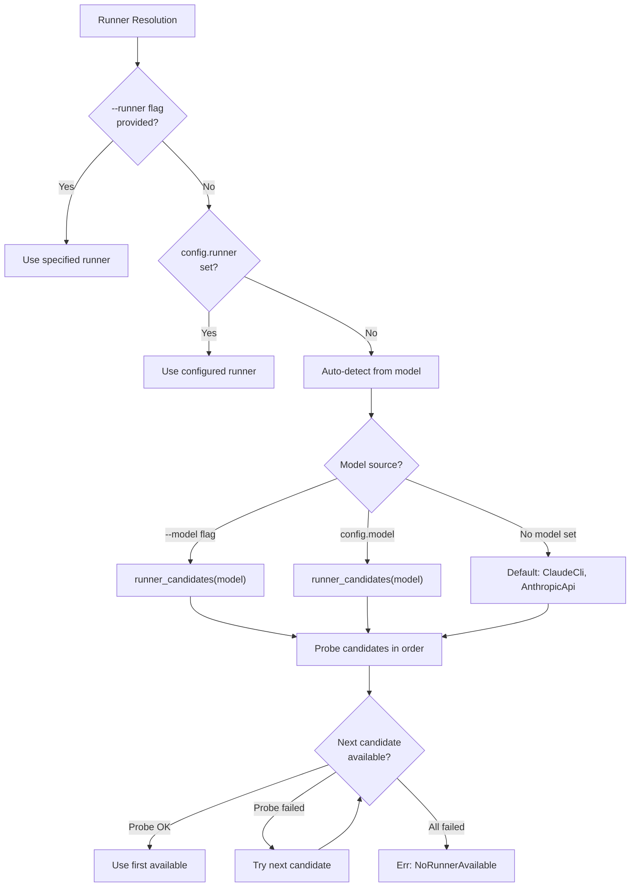
```mermaid
flowchart TB
    Start["Runner Resolution"]

    Start --> CLIFlag{"--runner flag<br/>provided?"}
    CLIFlag -- Yes --> UseCLI["Use specified runner"]
    CLIFlag -- No --> ConfigRunner{"config.runner<br/>set?"}
    ConfigRunner -- Yes --> UseConfig["Use configured runner"]
    ConfigRunner -- No --> AutoDetect["Auto-detect from model"]

    AutoDetect --> ModelSource{"Model source?"}
    ModelSource -- "--model flag" --> Candidates1["runner_candidates(model)"]
    ModelSource -- "config.model" --> Candidates2["runner_candidates(model)"]
    ModelSource -- "No model set" --> DefaultCandidates["Default: ClaudeCli, AnthropicApi"]

    Candidates1 --> Probe
    Candidates2 --> Probe
    DefaultCandidates --> Probe

    Probe["Probe candidates in order"]
    Probe --> ProbeLoop{"Next candidate<br/>available?"}
    ProbeLoop -- "Probe OK" --> UseCandidate["Use first available"]
    ProbeLoop -- "Probe failed" --> TryNext["Try next candidate"]
    TryNext --> ProbeLoop
    ProbeLoop -- "All failed" --> NoRunner["Err: NoRunnerAvailable"]
```

### Model-to-Runner Candidate Mapping

| Model Pattern | Candidates (in order) |
|---------------|----------------------|
| `sonnet`, `opus`, `haiku` | `ClaudeCli` > `AnthropicApi` |
| Contains `claude` | `AnthropicApi` > `ClaudeCli` |
| `gpt-*`, `o1*`, `o3*`, `o4*`, `chatgpt-*` | `CodexCli` > `OpenAiApi` > `CursorCli` |
| `codex-*`, `*-codex`, `*-codex-*` | `CodexCli` > `CursorCli` |
| Unknown | `CursorCli` |
| No model specified | `ClaudeCli` > `AnthropicApi` |

### Runner Details

| Runner | Binary / Endpoint | Default Model | Auth Mechanism | Env Vars |
|--------|-------------------|---------------|----------------|----------|
| `claude-cli` | `claude` binary | `"sonnet"` | Claude auth login | `CLAUDE_BINARY` |
| `anthropic-api` | `POST /v1/messages` | `claude-sonnet-4-6` | API key | `ANTHROPIC_API_KEY`, `ANTHROPIC_API_BASE_URL` |
| `openai-api` | `POST /v1/responses` | `gpt-5.2` | API key | `OPENAI_API_KEY`, `OPENAI_API_BASE_URL` |
| `codex-cli` | `codex` binary | Codex default | API key or `~/.codex/auth.json` | `OPENAI_API_KEY`, `CODEX_BINARY` |
| `cursor-cli` | `cursor-agent` binary | (none) | API key or `~/.cursor/auth.json` | `CURSOR_API_KEY`, `CURSOR_BINARY` |

### Runner Probes

Each runner is probed for availability before selection:

- **ClaudeCli:** `find_claude_binary()` + `probe_claude_auth()` (10s timeout, checks `is_usable()`)
- **AnthropicApi:** `resolve_api_key("ANTHROPIC_API_KEY", config_key)`
- **OpenAiApi:** `resolve_api_key("OPENAI_API_KEY", config_key)`
- **CodexCli:** `find_codex_binary()` + `check_codex_auth(api_key)`
- **CursorCli:** `find_cursor_binary()` + cursor auth probe (API key or `~/.cursor/auth.json`)

### Special Behaviors

- **CodexCli fallback:** If codex-cli returns a model error and `OPENAI_API_KEY` is available, the pipeline automatically retries with `openai-api` runner using `gpt-5.2`.
- **AnthropicApi:** Respects `model_override` from `run_tailoring()` and `Retry-After` headers on 429/529 responses.
- **OpenAiApi / CodexCli / CursorCli:** Ignore `model_override` and `max_budget_usd` parameters.

---

## 6. Analysis Pipeline

The analysis pipeline performs static analysis of the repository to detect languages, frameworks, and project structure. Results are cached in the config file, keyed by git HEAD commit and config hash.

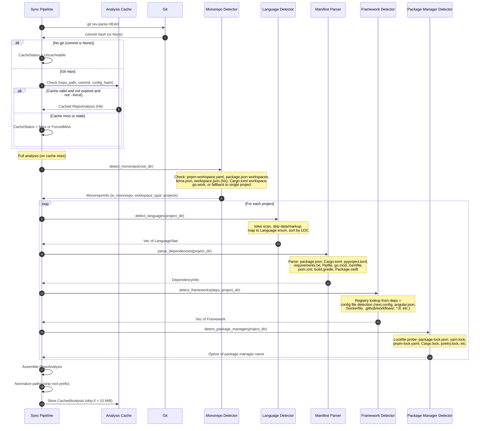
```mermaid
sequenceDiagram
    autonumber
    participant Pipeline as Sync Pipeline
    participant Cache as Analysis Cache
    participant Git as Git
    participant Mono as Monorepo Detector
    participant Lang as Language Detector
    participant Manifest as Manifest Parser
    participant FW as Framework Detector
    participant PM as Package Manager Detector

    Pipeline ->> Git: git rev-parse HEAD
    Git -->> Pipeline: commit hash (or None)

    alt No git (commit is None)
        Pipeline ->> Pipeline: CacheStatus = Uncacheable
    else Git repo
        Pipeline ->> Cache: Check (repo_path, commit, config_hash)
        alt Cache valid and not expired and not --force
            Cache -->> Pipeline: Cached RepoAnalysis (Hit)
        else Cache miss or stale
            Pipeline ->> Pipeline: CacheStatus = Miss or ForcedMiss
        end
    end

    Note over Pipeline: Full analysis (on cache miss)

    Pipeline ->> Mono: detect_monorepo(root_dir)
    Note over Mono: Check: pnpm-workspace.yaml, package.json workspaces,<br/>lerna.json, workspace.json (Nx), Cargo.toml workspace,<br/>go.work, or fallback to single project
    Mono -->> Pipeline: MonorepoInfo (is_monorepo, workspace_type, projects)

    loop For each project
        Pipeline ->> Lang: detect_languages(project_dir)
        Note over Lang: tokei scan, skip data/markup,<br/>map to Language enum, sort by LOC
        Lang -->> Pipeline: Vec of LanguageStat

        Pipeline ->> Manifest: parse_dependencies(project_dir)
        Note over Manifest: Parse: package.json, Cargo.toml, pyproject.toml,<br/>requirements.txt, Pipfile, go.mod, Gemfile,<br/>pom.xml, build.gradle, Package.swift
        Manifest -->> Pipeline: DependencyInfo

        Pipeline ->> FW: detect_frameworks(deps, project_dir)
        Note over FW: Registry lookup from deps +<br/>config file detection (next.config, angular.json,<br/>Dockerfile, .github/workflows/, *.tf, etc.)
        FW -->> Pipeline: Vec of Framework

        Pipeline ->> PM: detect_package_manager(project_dir)
        Note over PM: Lockfile probe: package-lock.json, yarn.lock,<br/>pnpm-lock.yaml, Cargo.lock, poetry.lock, etc.
        PM -->> Pipeline: Option of package manager name
    end

    Pipeline ->> Pipeline: Assemble RepoAnalysis
    Pipeline ->> Pipeline: Normalize paths (strip root prefix)
    Pipeline ->> Cache: Store CachedAnalysis (skip if > 10 MiB)
```

**Functional Description:**

1. Check git HEAD commit hash. Non-git repos skip caching entirely.
2. Compute a `config_hash` (SHA-256 of filter settings: `include_categories`, `exclude_categories`, `include_general`, `max_per_framework`).
3. If cache exists with matching `(repo_path, head_commit, config_hash)` and is not expired (< 7 days) and `--force` is not set, return cached result.
4. **Monorepo detection:** Checks workspace config files in priority order (pnpm > npm/yarn > lerna > Nx > Cargo > Go > single project).
5. **Language detection:** Uses `tokei` to count lines of code, skipping data/markup languages (JSON, YAML, HTML, CSS, etc.). Maps tokei language types to the `Language` enum. Sorts by LOC descending.
6. **Manifest parsing:** Reads 11 manifest file formats to extract dependency names. Files over 10 MB are skipped.
7. **Framework detection:** Looks up each dependency in the framework registry, then checks for config files (e.g., `next.config.js` → `nextjs`, `Dockerfile` → `docker`). Deduplicates and sorts alphabetically.
8. **Package manager detection:** Probes for lockfiles (`package-lock.json` → npm, `yarn.lock` → yarn, etc.).
9. Assembles the `RepoAnalysis`, normalizes project paths relative to the repo root, and caches if serialized size is under 10 MiB.

---

## 7. Tailoring Pipeline

The tailoring pipeline takes matched ADRs and uses LLM runners to generate tailored output files for each project.

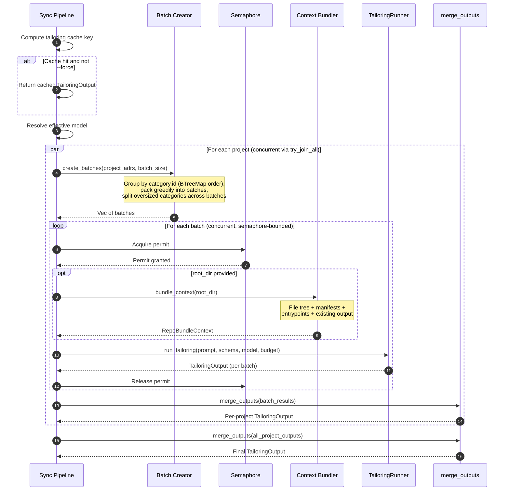
```mermaid
sequenceDiagram
    autonumber
    participant Pipeline as Sync Pipeline
    participant Batch as Batch Creator
    participant Sem as Semaphore
    participant Bundler as Context Bundler
    participant Runner as TailoringRunner
    participant Merge as merge_outputs

    Pipeline ->> Pipeline: Compute tailoring cache key
    alt Cache hit and not --force
        Pipeline ->> Pipeline: Return cached TailoringOutput
    end

    Pipeline ->> Pipeline: Resolve effective model

    par For each project (concurrent via try_join_all)
        Pipeline ->> Batch: create_batches(project_adrs, batch_size)
        Note over Batch: Group by category.id (BTreeMap order),<br/>pack greedily into batches,<br/>split oversized categories across batches
        Batch -->> Pipeline: Vec of batches

        loop For each batch (concurrent, semaphore-bounded)
            Pipeline ->> Sem: Acquire permit
            Sem -->> Pipeline: Permit granted

            opt root_dir provided
                Pipeline ->> Bundler: bundle_context(root_dir)
                Note over Bundler: File tree + manifests +<br/>entrypoints + existing output
                Bundler -->> Pipeline: RepoBundleContext
            end

            Pipeline ->> Runner: run_tailoring(prompt, schema, model, budget)
            Runner -->> Pipeline: TailoringOutput (per batch)
            Pipeline ->> Sem: Release permit
        end

        Pipeline ->> Merge: merge_outputs(batch_results)
        Merge -->> Pipeline: Per-project TailoringOutput
    end

    Pipeline ->> Merge: merge_outputs(all_project_outputs)
    Merge -->> Pipeline: Final TailoringOutput
```

**Functional Description:**

1. Check tailoring cache (keyed by SHA-256 of: ADR IDs, `--no-tailor`, project paths, existing file paths, model). On hit, skip tailoring entirely.
2. **ADR batching:** ADRs are grouped by `category.id` in sorted (BTreeMap) order. Categories are greedily packed into batches respecting `batch_size` (default 15). Oversized categories are split across multiple batches.
3. **Concurrent execution:** All projects are processed in parallel via `futures::future::try_join_all`. Within each project, batches run concurrently but are bounded by a shared `tokio::sync::Semaphore` (default concurrency = 10).
4. **Context bundling:** Before each invocation, the context bundler collects the repository file tree, key manifest contents, and entrypoint files to include in the prompt.
5. **Runner invocation:** Each batch sends a prompt containing the project JSON, ADR list, and context bundle. The runner returns a `TailoringOutput` with file sections, skipped ADRs, and a summary.
6. **Output validation:** Runner output is deserialized and validated against the `TailoringOutput` schema.
7. **Merge:** Batch results are merged per-project (overlapping file paths have sections merged by `adr_id`), then all project outputs are merged into a single `TailoringOutput`. Duplicate `skipped_adrs` are deduplicated by ID.
8. **Per-project timeout:** Each project has an independent timeout (default 600s). Timeout fires `ProjectFailed` event and returns `RunnerTimeout`.

---

## 8. Output Generation and Merge

### Managed Section Markers

All output files use HTML comment markers to delimit the managed section:

```
<!-- managed:actual-start -->
<!-- version: 3 -->
<!-- last-synced: 2026-03-02T10:00:00Z -->
<!-- adr-ids: uuid-1,uuid-2,uuid-3 -->

<!-- adr:uuid-1 start -->
...ADR content...
<!-- adr:uuid-1 end -->

<!-- adr:uuid-2 start -->
...ADR content...
<!-- adr:uuid-2 end -->

<!-- managed:actual-end -->
```

### Merge Strategy Decision Tree

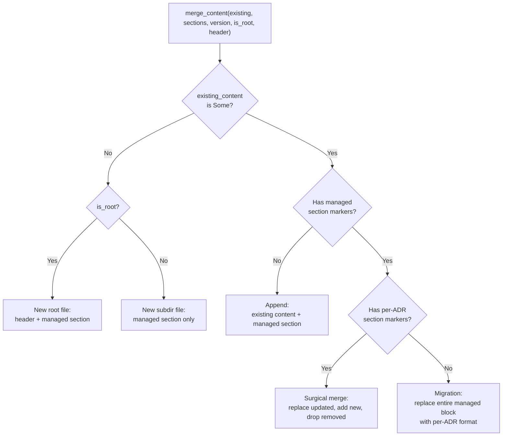
```mermaid
flowchart TB
    Start["merge_content(existing, sections, version, is_root, header)"]

    Start --> Exists{"existing_content<br/>is Some?"}

    Exists -- No --> IsRoot{"is_root?"}
    IsRoot -- Yes --> NewRoot["New root file:<br/>header + managed section"]
    IsRoot -- No --> NewSub["New subdir file:<br/>managed section only"]

    Exists -- Yes --> HasMarkers{"Has managed<br/>section markers?"}

    HasMarkers -- No --> Append["Append:<br/>existing content + managed section"]

    HasMarkers -- Yes --> HasAdrMarkers{"Has per-ADR<br/>section markers?"}

    HasAdrMarkers -- Yes --> Surgical["Surgical merge:<br/>replace updated, add new, drop removed"]
    HasAdrMarkers -- No --> Migration["Migration:<br/>replace entire managed block<br/>with per-ADR format"]
```

### Write Pipeline

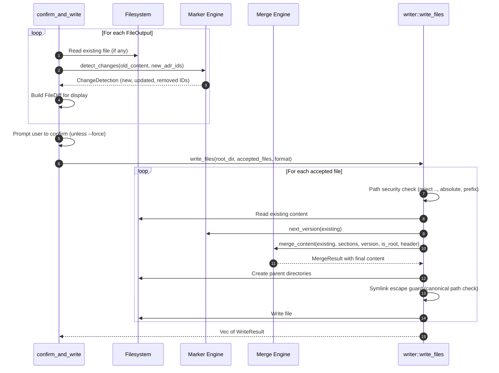
```mermaid
sequenceDiagram
    autonumber
    participant Pipeline as confirm_and_write
    participant FS as Filesystem
    participant Markers as Marker Engine
    participant Merge as Merge Engine
    participant Writer as writer::write_files

    loop For each FileOutput
        Pipeline ->> FS: Read existing file (if any)
        Pipeline ->> Markers: detect_changes(old_content, new_adr_ids)
        Markers -->> Pipeline: ChangeDetection (new, updated, removed IDs)
        Pipeline ->> Pipeline: Build FileDiff for display
    end

    Pipeline ->> Pipeline: Prompt user to confirm (unless --force)

    Pipeline ->> Writer: write_files(root_dir, accepted_files, format)

    loop For each accepted file
        Writer ->> Writer: Path security check (reject .., absolute, prefix)
        Writer ->> FS: Read existing content
        Writer ->> Markers: next_version(existing)
        Writer ->> Merge: merge_content(existing, sections, version, is_root, header)
        Merge -->> Writer: MergeResult with final content
        Writer ->> FS: Create parent directories
        Writer ->> Writer: Symlink escape guard (canonical path check)
        Writer ->> FS: Write file
    end

    Writer -->> Pipeline: Vec of WriteResult
```

**Functional Description:**

1. For each `FileOutput`, reads the existing file (if any) and runs `detect_changes` to identify which ADR sections are new, updated, or removed.
2. Displays diffs to the user for confirmation (skipped with `--force` or `--dry-run`).
3. For accepted files, the writer applies a two-layer path security check: first rejects `..` components, absolute paths, and root/prefix components; then verifies the canonicalized parent directory is within the canonicalized root (symlink escape guard).
4. **Merge strategies:**
   - **New file (root):** Prepends root header (`# Project Guidelines` or Cursor frontmatter) before the managed section.
   - **New file (subdir):** Managed section only.
   - **Existing with per-ADR markers (surgical):** Replaces matching sections in-place, appends new sections, drops removed sections — preserving document order.
   - **Existing with markers but no per-ADR markers (migration):** One-time migration from old format to per-ADR format.
   - **Existing without markers (append):** Appends managed section after existing content.
5. Each file failure is isolated — does not abort the batch. Returns a `WriteResult` per file with `Created`, `Updated`, or `Failed` action.

---

## 9. API Client

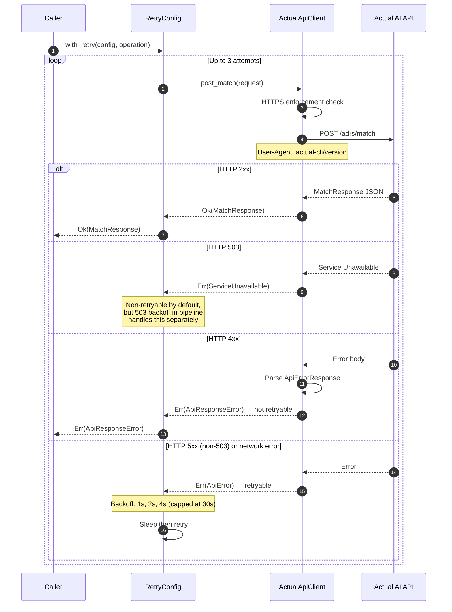
```mermaid
sequenceDiagram
    autonumber
    participant Caller
    participant Retry as RetryConfig
    participant Client as ActualApiClient
    participant API as Actual AI API

    Caller ->> Retry: with_retry(config, operation)

    loop Up to 3 attempts
        Retry ->> Client: post_match(request)
        Client ->> Client: HTTPS enforcement check
        Client ->> API: POST /adrs/match
        Note over Client: User-Agent: actual-cli/version

        alt HTTP 2xx
            API -->> Client: MatchResponse JSON
            Client -->> Retry: Ok(MatchResponse)
            Retry -->> Caller: Ok(MatchResponse)
        else HTTP 503
            API -->> Client: Service Unavailable
            Client -->> Retry: Err(ServiceUnavailable)
            Note over Retry: Non-retryable by default,<br/>but 503 backoff in pipeline<br/>handles this separately
        else HTTP 4xx
            API -->> Client: Error body
            Client ->> Client: Parse ApiErrorResponse
            Client -->> Retry: Err(ApiResponseError) — not retryable
            Retry -->> Caller: Err(ApiResponseError)
        else HTTP 5xx (non-503) or network error
            API -->> Client: Error
            Client -->> Retry: Err(ApiError) — retryable
            Note over Retry: Backoff: 1s, 2s, 4s (capped at 30s)
            Retry ->> Retry: Sleep then retry
        end
    end
```

**Functional Description:**

1. All API calls go through `ActualApiClient`, which enforces HTTPS for non-localhost URLs.
2. Requests include a `User-Agent: actual-cli/<version>` header.
3. **Retry logic (`RetryConfig`):** Default 3 attempts, initial delay 1s, backoff factor 2x, max delay 30s. Only `ActualError::ApiError` (network/5xx transient errors) triggers retry. All other error types return immediately.
4. **Error mapping:**
   - HTTP 503 → `ServiceUnavailable` (handled by pipeline-level 503 backoff: 10s, 30s, 60s)
   - HTTP 4xx → `ApiResponseError { code, message }` (parsed from response body, not retried)
   - HTTP 5xx (non-503) → `ApiError` (retried)
   - Network failure → `ApiError` (retried)
5. **503 backoff (pipeline level):** The sync pipeline wraps the retry-enabled API call in `fetch_with_503_backoff`, which adds additional waiting (10s, 30s, 60s) specifically for `ServiceUnavailable` responses, interruptible by Ctrl+C.
6. **API endpoints:**
   - `POST /adrs/match` — main ADR matching
   - `GET /taxonomy/languages` — language taxonomy
   - `GET /taxonomy/frameworks` — framework taxonomy
   - `GET /taxonomy/categories` — category taxonomy
   - `GET /health` — health check
   - `POST /counter/record` — anonymous telemetry (Bearer auth)

---

## 10. Data Flow (End-to-End)


```mermaid
flowchart LR
    subgraph Input["Input"]
        FS["Filesystem<br/>(source code, manifests,<br/>lockfiles, config files)"]
        ConfigFile["Config YAML<br/>(~/.actualai/actual/<br/>config.yaml)"]
    end

    subgraph Analysis["Analysis"]
        SA["Static Analyzer<br/>(tokei, registry, parsers)"]
        RA["RepoAnalysis<br/>(projects, languages,<br/>frameworks)"]
    end

    subgraph APILayer["API Layer"]
        MR["MatchRequest<br/>(projects, options)"]
        API["Actual AI API<br/>POST /adrs/match"]
        Resp["MatchResponse<br/>(matched ADRs)"]
    end

    subgraph Filter["Filtering"]
        Rej["Rejection Filter<br/>(remove user-rejected)"]
        Filtered["Filtered ADRs"]
    end

    subgraph Tailoring["Tailoring"]
        Batched["Batched ADRs<br/>(by category)"]
        LLM["LLM Runner<br/>(claude-cli, anthropic-api,<br/>openai-api, codex-cli,<br/>cursor-cli)"]
        TO["TailoringOutput<br/>(files, sections,<br/>skipped ADRs)"]
    end

    subgraph Output["Output"]
        MergeStep["Merge Engine<br/>(surgical, append,<br/>migration)"]
        Files["Output Files<br/>(CLAUDE.md, AGENTS.md,<br/>or .cursor/rules/*.mdc)"]
    end

    FS --> SA
    ConfigFile --> SA
    SA --> RA
    RA --> MR
    ConfigFile --> MR
    MR --> API
    API --> Resp
    Resp --> Rej
    ConfigFile --> Rej
    Rej --> Filtered
    Filtered --> Batched
    Batched --> LLM
    LLM --> TO
    TO --> MergeStep
    FS --> MergeStep
    MergeStep --> Files
```

**Data Transformation Summary:**

| Stage | Input | Output |
|-------|-------|--------|
| Static Analysis | Filesystem (source, manifests, lockfiles) | `RepoAnalysis` (projects, languages, frameworks) |
| API Match | `MatchRequest` (from RepoAnalysis + config filters) | `MatchResponse` (matched ADRs with metadata) |
| Rejection Filter | `MatchResponse` + rejected ADR IDs from config | Filtered ADR list |
| Batching | Filtered ADRs | Batches grouped by category (respecting batch_size) |
| Tailoring | Batched ADRs + project context | `TailoringOutput` (file sections + skipped ADRs) |
| Merge | `TailoringOutput` + existing file content | Merged file content (with managed section markers) |
| Write | Merged content | Output files on disk |

---

## 11. Configuration Resolution

Each configuration value follows a resolution cascade. Higher-priority sources override lower ones.


```mermaid
flowchart LR
    CLI["CLI Flag<br/>(highest priority)"]
    ENV["Environment Variable"]
    CFG["Config File<br/>(~/.actualai/actual/<br/>config.yaml)"]
    DEF["Default Constant<br/>(lowest priority)"]

    CLI --> ENV --> CFG --> DEF
```

### Resolution Per Setting

| Setting | CLI Flag | Env Var | Config Key | Default |
|---------|----------|---------|------------|---------|
| API URL | `--api-url` | — | `api_url` | `https://api-service.api.prod.actual.ai` |
| Model | `--model` | — | `model` | `claude-sonnet-4-6` (varies by runner) |
| Runner | `--runner` | — | `runner` | Auto-detected from model |
| Output format | `--output-format` | — | `output_format` | `claude-md` |
| Batch size | — | — | `batch_size` | `15` |
| Concurrency | — | — | `concurrency` | `10` |
| Timeout | — | — | `invocation_timeout_secs` | `600` (seconds) |
| Max budget | `--max-budget-usd` | — | `max_budget_usd` | (none) |
| Max turns | — | — | `max_turns` | `10` (claude-cli only) |
| Include general | — | — | `include_general` | (none) |
| Max per framework | — | — | `max_per_framework` | (none) |
| Include categories | — | — | `include_categories` | (none) |
| Exclude categories | — | — | `exclude_categories` | (none) |
| Telemetry | — | — | `telemetry.enabled` | (none) |
| Anthropic API key | — | `ANTHROPIC_API_KEY` | `anthropic_api_key` | (none) |
| OpenAI API key | — | `OPENAI_API_KEY` | `openai_api_key` | (none) |
| Cursor API key | — | `CURSOR_API_KEY` | `cursor_api_key` | (none) |
| Config file path | — | `ACTUAL_CONFIG` | — | `~/.actualai/actual/config.yaml` |
| Config directory | — | `ACTUAL_CONFIG_DIR` | — | `~/.actualai/actual/` |

### ConfigKey Dotpath Reference

| Dotpath | Type | Constraints |
|---------|------|-------------|
| `api_url` | String | — |
| `model` | String | Soft warning if not in known models |
| `batch_size` | usize | >= 1 |
| `concurrency` | usize | >= 1 |
| `invocation_timeout_secs` | u64 | >= 1 |
| `max_budget_usd` | f64 | Finite, > 0.0 |
| `include_general` | bool | — |
| `max_per_framework` | u32 | >= 1 |
| `include_categories` | comma-separated | Empty string clears |
| `exclude_categories` | comma-separated | Empty string clears |
| `telemetry.enabled` | bool | — |
| `output_format` | enum | `claude-md`, `agents-md`, `cursor-rules` |
| `runner` | enum | `claude-cli`, `anthropic-api`, `openai-api`, `codex-cli`, `cursor-cli` |
| `anthropic_api_key` | String | — |
| `openai_api_key` | String | — |
| `cursor_api_key` | String | — |
| `max_turns` | u32 | >= 1 |

---

## 12. Error Handling and Exit Codes

### ActualError Variants and Exit Codes

| Exit Code | Category | Variants |
|-----------|----------|----------|
| **0** | Success | (no error) |
| **1** | Runtime Error | `RunnerFailed`, `RunnerOutputParse`, `ConfigError`, `RunnerTimeout`, `AnalysisEmpty`, `TailoringValidationError`, `InternalError`, `TerminalIOError` |
| **2** | Auth / Setup Error | `ClaudeNotFound`, `ClaudeNotAuthenticated`, `CodexNotFound`, `CodexNotAuthenticated`, `CursorNotFound`, `CursorNotAuthenticated`, `ApiKeyMissing`, `CodexCliModelRequiresApiKey`, `NoRunnerAvailable` |
| **3** | API / Credit Error | `CreditBalanceTooLow`, `ApiError`, `ApiResponseError`, `ServiceUnavailable` |
| **4** | User Action | `UserCancelled` |
| **5** | I/O Error | `IoError` |

### Error Features

- **Hints:** Most error variants provide an actionable `hint()` message suggesting how to fix the issue (e.g., "Run `claude auth login` to authenticate" for `ClaudeNotAuthenticated`).
- **Model error detection:** `RunnerFailed` errors are checked for model-related keywords (`"model is not supported"`, `"model not found"`, etc.) via `is_model_error()`, enabling automatic fallback from `codex-cli` to `openai-api`.
- **Retry behavior:** Only `ApiError` (transient network/5xx) triggers retry. All other errors return immediately. `ServiceUnavailable` (503) is handled by a separate pipeline-level backoff mechanism.

---

## 13. UI Architecture

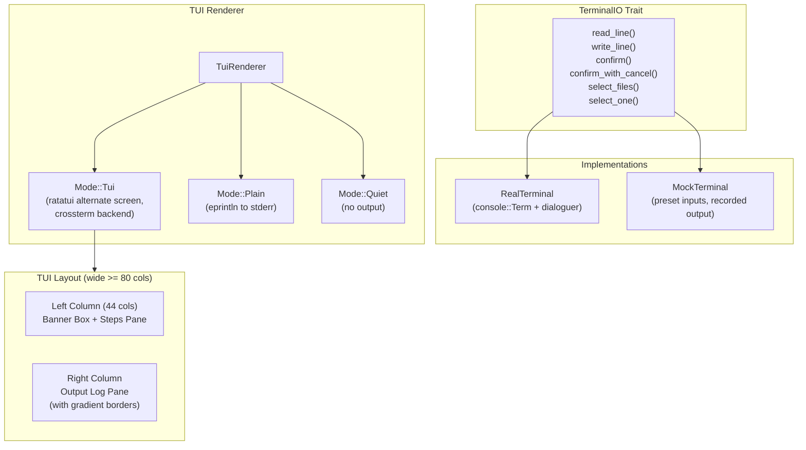
```mermaid
flowchart TB
    subgraph Trait["TerminalIO Trait"]
        TIO["read_line()<br/>write_line()<br/>confirm()<br/>confirm_with_cancel()<br/>select_files()<br/>select_one()"]
    end

    subgraph Implementations["Implementations"]
        Real["RealTerminal<br/>(console::Term + dialoguer)"]
        Mock["MockTerminal<br/>(preset inputs, recorded output)"]
    end

    subgraph TUI["TUI Renderer"]
        Renderer["TuiRenderer"]
        TuiMode["Mode::Tui<br/>(ratatui alternate screen,<br/>crossterm backend)"]
        PlainMode["Mode::Plain<br/>(eprintln to stderr)"]
        QuietMode["Mode::Quiet<br/>(no output)"]
    end

    subgraph Layout["TUI Layout (wide >= 80 cols)"]
        Left["Left Column (44 cols)<br/>Banner Box + Steps Pane"]
        Right["Right Column<br/>Output Log Pane<br/>(with gradient borders)"]
    end

    TIO --> Real
    TIO --> Mock

    Renderer --> TuiMode
    Renderer --> PlainMode
    Renderer --> QuietMode

    TuiMode --> Layout
```

### Mode Selection

| Condition | Mode |
|-----------|------|
| `--quiet` flag | `Quiet` (all output suppressed) |
| `--no-tui` flag OR stderr is not a terminal | `Plain` (line-based output to stderr) |
| Otherwise | `Tui` (full alternate-screen TUI via ratatui/crossterm) |

If TUI setup fails (e.g., `enable_raw_mode()` error), falls back to `Plain` mode.

### TUI Components

- **Banner Box:** Branded ASCII art with version number (top-left, 44 columns wide, 15 rows tall).
- **Steps Pane:** Five pipeline phases with status icons:
  - `Waiting` = `○`
  - `Running` = animated spinner (`⠋⠙⠹⠸⠼⠴⠦⠧⠇⠏`)
  - `Success` = `✔`
  - `Warn` = `⚠`
  - `Error` = `✖`
  - `Skipped` = `─`
- **Output Log Pane:** Scrollable log (1000-line buffer) with soft word-wrapping, per-phase log buffers, and keyboard navigation (`StepUp`, `StepDown`, `ScrollUp`, `ScrollDown`, `ScrollTop`, `ScrollBottom`).
- **Interactive Overlays:** Inline confirm dialogs, file selection checkboxes, and single-select prompts — rendered within the TUI without suspending the alternate screen.

### Plain Mode Output

In plain mode, phase status is written to stderr with simple prefix icons:
- Start: `  ○ {message}`
- Success: `  ✔ {message}`
- Skip: `  ─ {message}`
- Error: `  ✖ {message}`
- Warn: `  ⚠ {message}`

### TerminalIO Trait

The `TerminalIO` trait abstracts all user interaction, enabling testing with `MockTerminal`:

| Method | Purpose |
|--------|---------|
| `read_line(prompt)` | Read a line of text from the user |
| `write_line(text)` | Write a line of text to the terminal |
| `confirm(prompt)` | Yes/no confirmation (default: no) |
| `confirm_with_cancel(prompt)` | Yes/no/cancel confirmation |
| `select_files(prompt, items, defaults)` | Multi-select checkbox |
| `select_one(prompt, items, default)` | Single-select list |

`RealTerminal` uses `console::Term` for I/O and `dialoguer` for interactive prompts. `MockTerminal` uses preset input sequences and records all output for test assertions.
